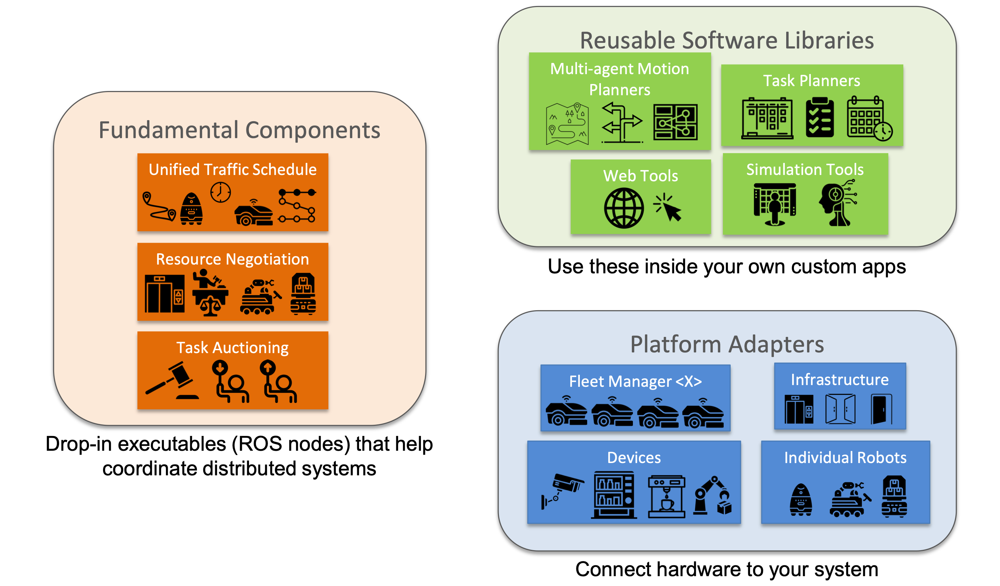
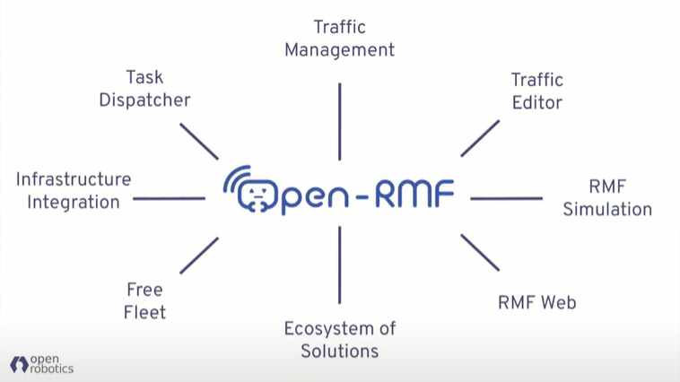

# 00. Introduction

OpenRMF는 **이종 로봇 간의 상호 운용성**을 지원하는 오픈 소스 프레임워크입니다. 이 워크숍은 OpenRMF의 핵심 기능을 직접 실습하며 배우는 것을 목표로 합니다.

* OpenRMF의 전체적인 아키텍쳐
---

### 목차
1. OpenRMF란? <링크1: OpenRMF란?>
2. 워크숍 목표 <링크2: 워크숍 목표>
3. 참고 자료 <링크3: 참고 자료>
4. Next Step <링크4: Next Step>

---

## 1. OpenRMF란?
OpenRMF는 제조사가 다른 여러 로봇이 하나의 공간에서 효율적으로 협업하도록 돕는 미들웨어입니다.

- **Traffic Management (교통 관리)**: 로봇 간의 경로 충돌을 방지하고 양보를 중재합니다.
- **Task Dispatcher (작업 할당)**: 여러 로봇에게 작업을 최적의 방식으로 분배합니다.
- **Infra Integration (인프라 연동)**: 엘리베이터나 자동문 같은 건물 인프라와 로봇을 연동합니다.
- **ROS 2 기반**: ROS 2 생태계와 강력하게 연동됩니다.

---

## 2. 워크숍 목표
이 워크숍은 이론 학습보다 **참가자가 직접 시뮬레이션을 돌려보는 경험**을 최우선으로 합니다.

- 참가자는 자신의 노트북에서 **Gazebo 시뮬레이션**을 실행합니다.
- OpenRMF가 실제로 어떻게 로봇을 제어하고 교통을 정리하는지 눈으로 확인합니다.
- 복잡한 이론보다는 **"어떻게 동작하는가"**에 집중합니다.

---

## 3. 참고 자료
- [OpenRMF 공식 문서](https://openrmf.readthedocs.io/en/latest/)

---

## Next Step
OpenRMF의 개념을 이해했다면, 이제 실습을 위한 **환경 설정**을 시작해봅시다.

- **Next**: [01 Install 문서](01_install.md)