# 02. Traffic Editor

Traffic Editor는 로봇이 주행할 공간의 **규칙과 의도를 정의하는 도구**입니다.
이 단계에서는 단순히 맵을 보는 것을 넘어, **직접 조작(Action)**하고 **RMF의 시각(Result)**을 확인하며 공간 정의 규칙을 체득합니다.

## 목차
1. [Introduce](#1-introduce)
2. [Traffic Map 정의](#2-what-traffic-editor-defines)
3. [실행 및 기본 조작](#3-commands-execution)
4. [핵심 개념 탐구 (Hands-on Concepts)](#4-hands-on-concepts)
5. [Project File (.building.yaml)](#5-project-file-buildingyaml)
6. [Demo: RMF의 시선으로 보기](#6-demo)
7. [What You Should Understand After This Phase](#7-what-you-should-understand-after-this-phase)
8. [참고 자료 및 Next Step](#8-reference--next-step)

---

## 1. Introduce

여러 로봇이 하나의 공간에서 효율적으로 움직이려면 **사전에 정의된 규칙**이 필요합니다.
RMF(Robot Middleware Framework)가 상황을 판단하고 조율하기 위해서는, 먼저 공간에 대한 정보가 디지털 형태로 정의되어야 합니다. 

[Traffic Editor](https://osrf.github.io/ros2multirobotbook/traffic-editor.html)는 이러한 **시뮬레이션 환경과 공간 규칙을 쉽게 생성하기 위한 도구**입니다.
단순히 로봇의 경로를 그리는 것이 아니라, RMF가 판단에 사용할 **규칙의 지도**를 만드는 것이 핵심입니다.

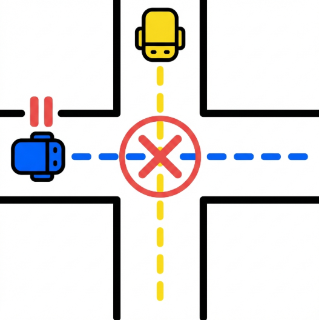
* 위 사진처럼, 여러 로봇이 하나의 공간에서 부딫히지 않고 움직이려면, 로봇이 어디서 멈춰야 하는지, 어느 방향으로 이동해야 하는지 미리 정의해야 합니다.


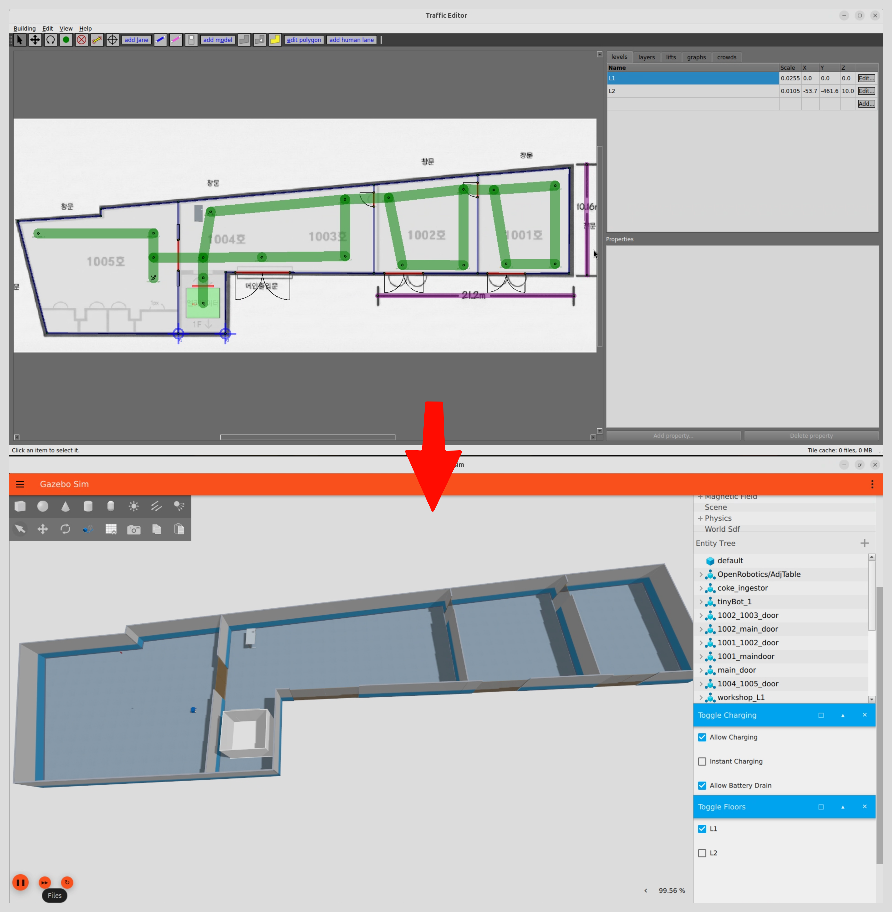
* 위 사진처럼, Traffic Editor에서 정의된 규칙을 바탕으로 시뮬레이션 환경이 구성됩니다. OpenRMF가 아니여도, 시뮬레이션 환경이 필요하다면 Traffic Editor를 통하여 쉽게 구성할 수 있습니다.

---

## 2. What Traffic Editor Defines

### 표준화된 규칙 언어

Traffic Editor는 표준화된 형식으로 공간 정보를 정의합니다:
*   로봇이 어디서 멈춰야 하는지 (Vertex)
*   어느 방향으로 이동해야 하는지 (Lane의 방향성)
*   어떤 속도로 이동해야 하는지 (Lane 속성)
*   공용 자원은 어디에 있는지 (Door, Lift)

이러한 규칙들은 `.building.yaml` 파일로 저장되며, RMF와 시뮬레이션 도구들이 공통으로 이해할 수 있는 형식입니다.

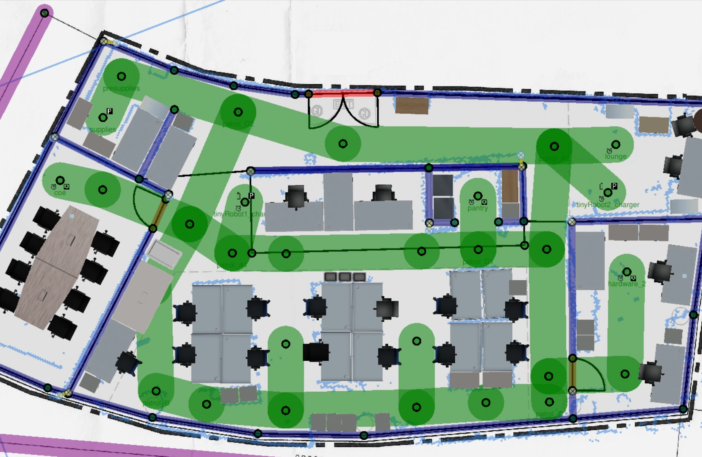
* 이렇게 사무실 공간을 모델링 할 수 있습니다.
---

## 3. Commands (Execution)
터미널 창을 하나 열고 Traffic Editor를 실행하여 실제 인터페이스를 확인해 봅니다.

```bash
traffic-editor ~/rmf_ws/src/rosconkr_rmf/rosconkr_maps/maps/workshop/workshop.building.yaml
```

### 기본 조작 (Try It Yourself)

Traffic Editor를 띄워놓고 다음 동작들을 바로 수행해 봅니다.

*   **확대/축소 (Action)**: 마우스 휠을 굴려보세요.
    *   **Result**: 맵의 세밀한 Lane 연결 상태나 전체 구조를 빠르게 오갈 수 있습니다.
*   **이동 (Action)**: 마우스 휠을 누른 상태로 드래그해보세요.
    *   **Result**: 보고 싶은 구역으로 시점을 이동할 수 있습니다.
*   **선택 (Action)**: 화면의 점(Vertex)이나 선(Lane)을 좌클릭해보세요.
    *   **Result**: 선택된 요소가 하이라이트되고, 우측 패널에 속성이 표시됩니다.

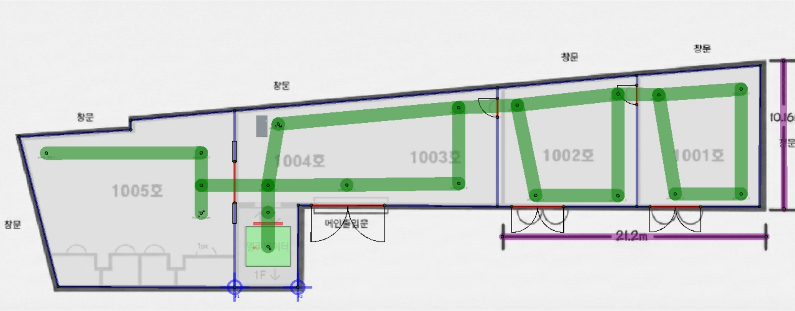

---

## 4. Concepts

직접 마우스로 요소를 클릭하며 RMF가 이 공간을 어떻게 이해하는지 확인합니다.

### Vertex (정점)

Vertex는 로봇이 **멈출 수 있는 지점**이자, 작업(Task)의 목표 지점입니다.

* 맵 상의 아무 점(Vertex)이나 클릭해보세요.
* 우측 속성창(Property)에 `name` 필드가 보이나요?
   - 이름이 있는 Vertex: 로봇에게 "여기로 가라"고 명령할 수 있는 목적지입니다. (예: `station_1`, `charge_point`)
   - 이름이 없는 Vertex: 단순히 경로를 잇는 경유지입니다.

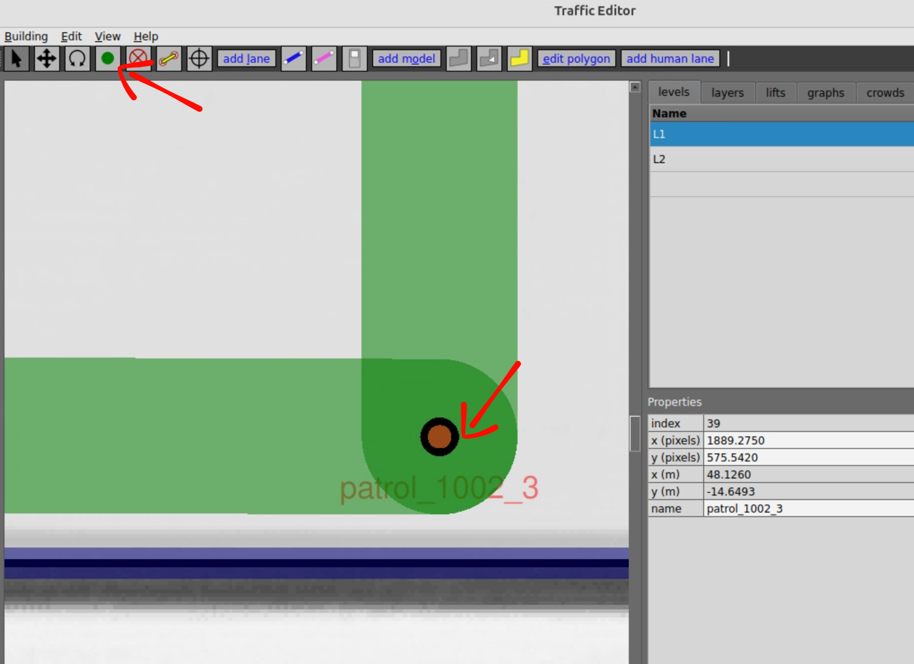

* 또한 로봇의 충전소, 혹은 holding이 가능한 장소도 Vertex로 정의할 수 있습니다.
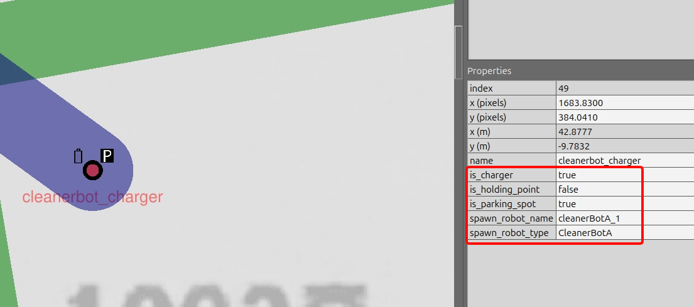

### Lane (경로)

Lane은 로봇의 **이동 규칙과 방향성**을 정의합니다.

* 맵의 선(Lane)을 하나 클릭하고, 우측 속성창의 `bidirectional` 박스 확인하세요.
* bidirectional(True): 양방향 통행 가능 (넓은 복도 등)
* bidirectional(False): 일방통행 (좁은 길). 화살표 방향으로만 로봇이 이동할 수 있습니다.
   
이 설정을 통해 "들어가는 문"과 "나오는 문"을 강제로 구분할 수 있습니다.

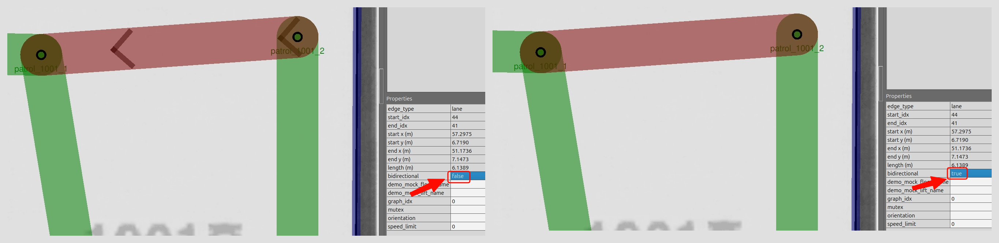

* 아무 Lane이나 선택 후, bidirectional를 false로 바꿔보세요. 
### Level (층/구역)

Level은 건물의 층(Layer)이나 논리적인 구역 단위를 관리합니다.

* 좌측 상단의 'Levels' 목록에서 다른 이름을 클릭해보세요.
* 배경 도면과 그래프가 해당 층의 것으로 즉시 전환됩니다. RMF는 이 층들을 엘리베이터로 연결된 별개의 공간으로 인식합니다.
* 즉 OpenRMF는 층별로 독립적인 운용이나, 층간 이동을 모두 지원합니다.

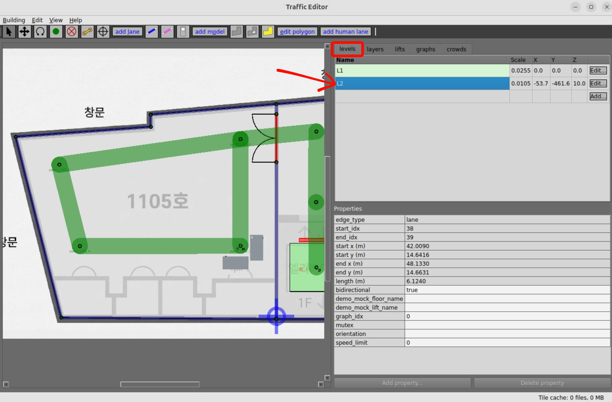

### Door (문)

Door는 RMF가 제어하는 공용 자원입니다.

* 초록색으로 표시된 문 아이콘을 클릭해보세요.
* 우측 속성창에 문의 `name`과 `type`(sliding, hinged 등)이 나타납니다. 시뮬레이터는 이 정보를 보고 어떤 종류의 문을 생성할지 결정합니다.

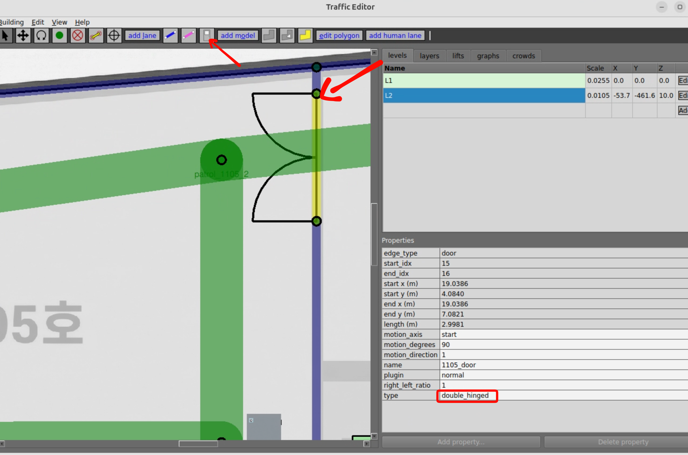 
* door type을 sliding, hinged로 바꿔보세요. 

### Lift (엘리베이터)

Lift는 층간 이동을 위한 특수 자원입니다.
* 우측 상단에서 lifts를 눌러 엘리베이터를 추가할 수 있습니다.
* 엘리베이터는 여러 층에 걸쳐 존재할 수 있으며, 각 층에 문을 설치할 수도 있습니다. 

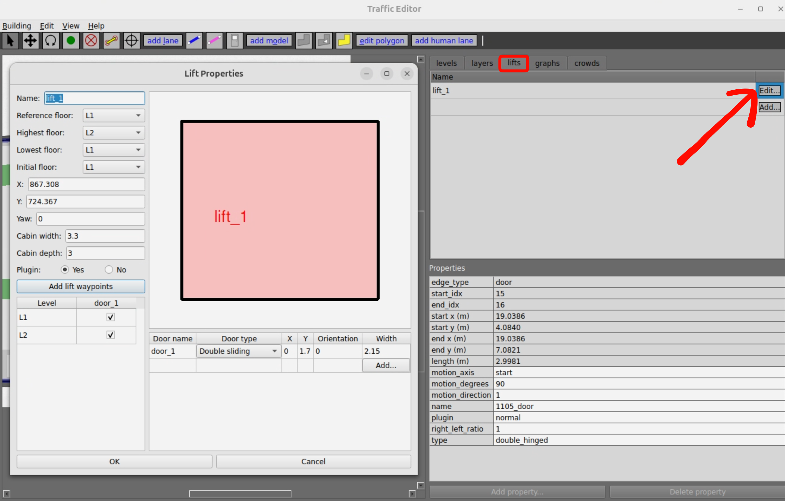


#### 이렇게 정의된 요소들을 바탕으로 시뮬레이션 월드가 생성됩니다.


---

## 5. Project File (.building.yaml)

Traffic Editor의 작업 결과물은 `.building.yaml` 파일로 저장됩니다.
이 파일은 **시뮬레이션 월드 생성과 RMF 그래프 생성의 기준 데이터**가 됩니다.

워크숍 제공 맵의 `.building.yaml` 파일을 직접 확인해 볼 수 있습니다:

```bash
gnome-text-editor ~/rmf_ws/src/rosconkr_rmf/rosconkr_maps/maps/workshop/workshop.building.yaml
```

파일을 확인해보면 총 구조로 볼 수 있습니다. 


---

## 6. Demo: Traffic Editor에 모델도 추가해보기 
* 위쪽 add model을 클릭하면 현재 사용가능한 모델을 볼 수 있습니다. 
* 이러한 모델들을 추가해서 더 사실적인 시뮬레이션 월드를 만들 수 있습니다. 

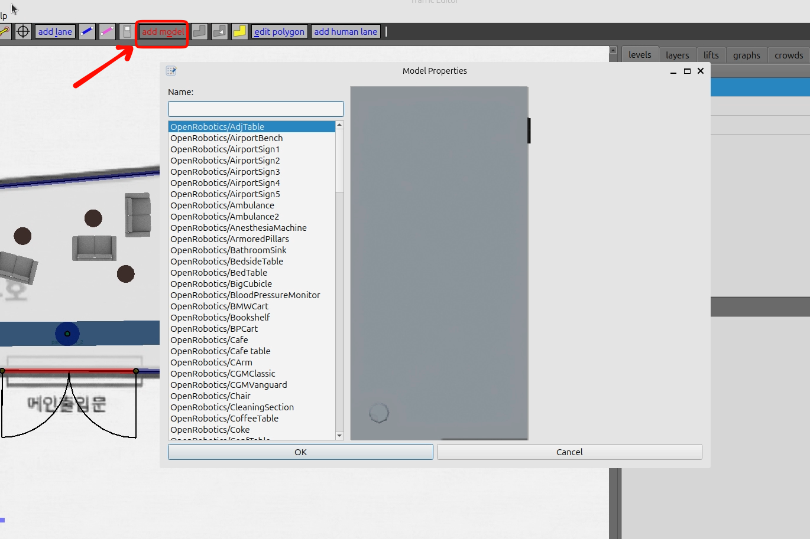

* 원하는 모델을 클릭하고 Traffic Map을 더 상세하게 만들어보세요(수정해도 workshop에는 지장이 없습니다.)


---

## 7. What You Should Understand After This Phase
*   **Traffic Editor는 '그림판'이 아니라 '규칙 편집기'**입니다. 우리가 그린 vertex나 lane은 곧 관제 시스템의 규칙이 됩니다. 
*   **배경 도면은 사람을 위한 참고용**일 뿐, 로봇은 오직 Vertex와 Lane만 인식합니다.
*   **Action & Result**: 직접 클릭하고 가시성을 끄고 켜보며, 데이터의 속성이 어떻게 구성되어 있는지 확인했습니다.

---

## 8. Reference & Next Step

### rmf_demos (optional)

시간적 여유가 있다면 `rmf_demos`의 다양한 예제 맵을 통해 다른 프로젝트들은 어떻게 공간을 구성했는지 비교해 볼 수 있습니다.

* 사무실 환경으로 구성된 맵
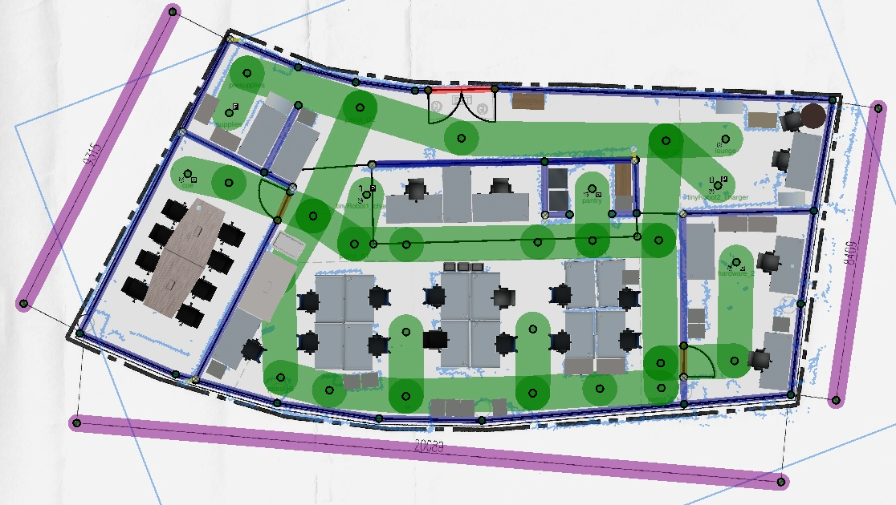
```bash
traffic-editor ~/rmf_ws/src/rmf_demos/rmf_demos_map/maps/office/office.building.yaml
```

* hotel 환경(3층 구성)

```bash
traffic-editor ~/rmf_ws/src/rmf_demos/rmf_demos_map/maps/hotel/hotel.building.yaml
```

* 걸어다니는 사람에 대한 시뮬레이션 공항 맵
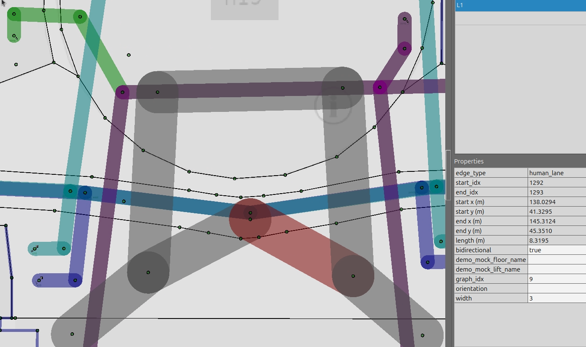
```bash
traffic-editor ~/rmf_ws/src/rmf_demos/rmf_demos_map/maps/airport/airport.building.yaml
```

### 참고 자료

*   **Traffic Editor 공식 문서**: [Traffic Editor 가이드](https://osrf.github.io/ros2multirobotbook/traffic-editor.html)
*   **rmf_site**: [GitHub - rmf_site](https://github.com/open-rmf/rmf_site)
    *   Traffic Editor의 차세대 버전(웹 기반)으로, 설치 없이 브라우저에서 바로 체험해볼 수 있습니다.

### Next Step

공간 규칙(Traffic Map)이 완성되었습니다.
이제 이 규칙들이 3D 시뮬레이션 세계(Gazebo)에서 어떻게 "물리적인 실체"가 되는지 확인할 차례입니다.

*   다음 문서로 이동: [03 Simulation & Public Resource](./03_simulation_public_resource.md)
