# 03. Simulation & Public Resource

1. Phase 1에서 정의한 규칙이 **Gazebo에서 어떻게 구현되는지** 확인합니다.
2. CLI와 RViz를 통해 시뮬레이션 환경과 로봇의 동작을 관찰합니다.

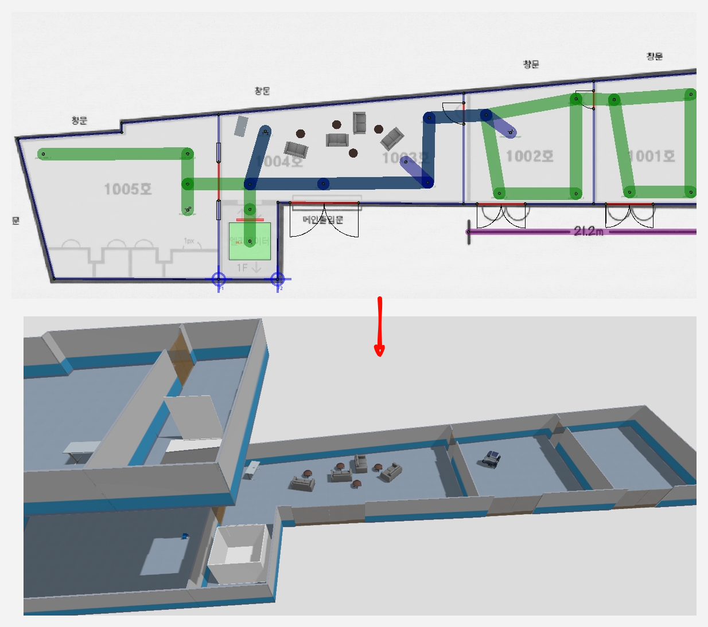

## 목차
1. [Introduce](#1-introduce)
2. [World](#2-world)
3. [Task](#3-task)
4. [Public Resource](#4-public-resource)
5. [What You Should Understand After This Phase](#5-what-you-should-understand-after-this-phase)
6. [Next Step](#6-next-step)

---

## 1. Introduce

Traffic Editor에서 정의한 규칙들이 이제 실제 시뮬레이션 환경으로 이어집니다.
**Traffic Editor → Gazebo**로 이어지는 흐름은 RMF 워크플로의 핵심입니다.

이 단계의 목표는 규칙이 실제 환경에서 어떻게 표현되는지 확인하는 것입니다.
Traffic Editor에서 그린 Vertex와 Lane이 Gazebo의 3D 공간에서 어떻게 보이는지, 로봇이 실제로 그 규칙을 따라 움직이는지를 관찰합니다.
CLI 명령어로 Task를 전송하면, 로봇이 어떻게 반응하고 이동하는지 실시간으로 확인할 수 있습니다.

---

## 2. World

**World**는 맵, 로봇, 자원이 함께 배치된 시뮬레이션 공간입니다.
Traffic Editor에서 정의한 문과 엘리베이터가 Gazebo 환경에 실제로 반영되어 있는지 확인합니다.

### Gazebo 실행

시뮬레이션을 시작하려면 다음 명령어를 실행합니다:

```bash
ros2 launch rosconkr_gz workshop.launch.xml
```

실행하면 Gazebo 창이 열리고, 사전에 정의된 맵과 로봇이 로드됩니다.
처음 로드될 때 몇 초 정도 소요될 수 있으며, 로봇 모델과 센서가 초기화되는 과정을 볼 수 있습니다.


### World 구조 이해

시뮬레이션이 실행되면, Traffic Editor에서 봤던 요소들이 3D로 구현된 것을 확인할 수 있습니다.

맵의 벽과 바닥은 Traffic Editor의 2D 도면이 3D 구조물로 변환된 것입니다.
문과 엘리베이터도 Gazebo 객체로 생성되어 있으며, RMF와 연동되어 상태를 주고받을 준비가 되어 있습니다.

이 모든 요소가 어떻게 배치되었는지를 천천히 둘러보면서, Phase 1에서 Traffic Editor로 그렸던 구조와 비교해 봅니다.
카메라를 이동시켜 다양한 각도에서 맵을 관찰하면 공간 구조를 더 잘 이해할 수 있습니다.

1. Robot을 Spawn하도록 설정한 Vertex 
vertex설정에 Spawn Robot type을 지정하면, Gazebo에 로봇이 spawn됩니다.
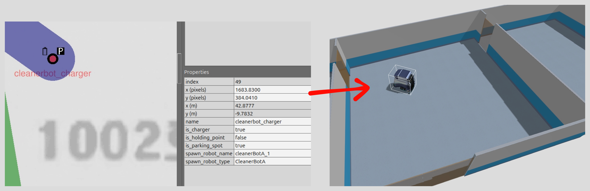

2. traffic editor 에서 설정한 model 
traffic editor 에서 설정한 model들도, Gazebo에 spawn되며 더욱 사실적인 환경을 구축할 수 있습니다. 
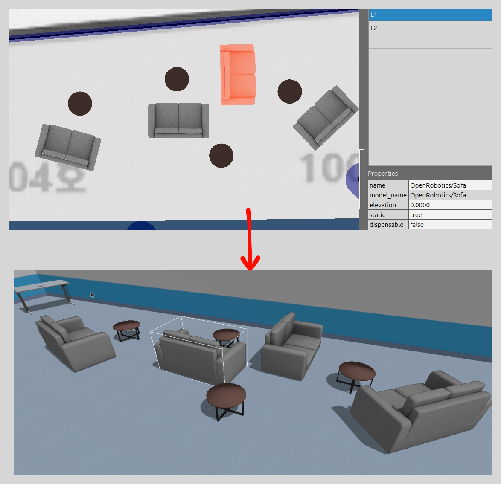

3. door, E/V spawn 
door, E/V spawn은 traffic editor에서 설정한 vertex에 spawn됩니다.
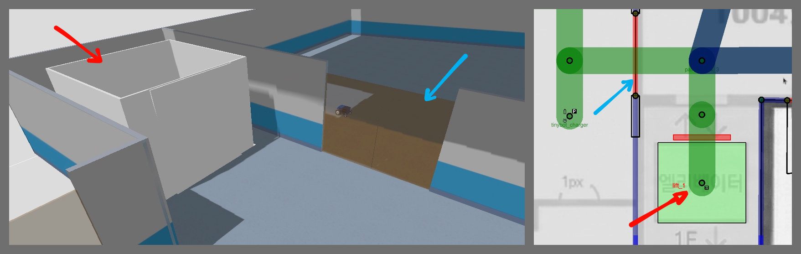


### RViz를 통한 관찰

RViz는 로봇의 내부 상태와 인식 정보를 시각화하는 도구입니다.
Gazebo가 "외부에서 본 모습"이라면, RViz는 "로봇이 세상을 어떻게 인식하는지"를 보여줍니다.

RViz를 함께 실행하면 로봇의 센서 데이터, 인식한 맵, 계획된 경로 등을 실시간으로 확인할 수 있습니다.
특히 로봇이 자신의 위치를 어떻게 파악하는지(localization), 어떤 경로를 계획했는지(path planning)를 시각적으로 이해할 수 있습니다.

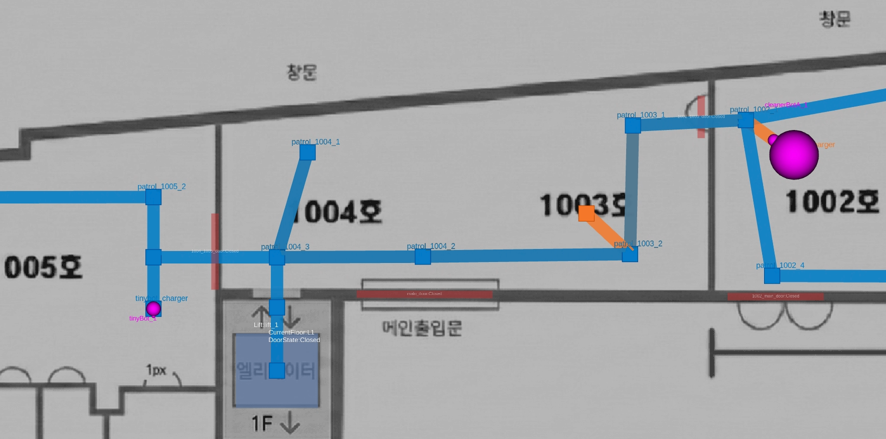

---

## 3. Task

**Task**는 로봇을 움직이게 만드는 최소 단위입니다.
CLI로 Task를 보내면 로봇이 이동을 시작하며, RMF가 경로를 계획하고 실행합니다.

이번 단계에서는 **Loop Task**를 보내보겠습니다. Loop Task는 단순하게 로봇을 순찰하도록 하는 Task 명령 타입입니다.

### Loop Task 

Loop Task는 지정된 두 지점을 반복 왕복하는 작업입니다.
이번에는 문을 포함한 경로를 선택하여, 로봇이 공용 자원을 어떻게 사용하는지 관찰합니다.

* Gazebo 시뮬레이션이 실행중인 상태로, 새로운 터미널을 열고 아래 명령어를 입력해보세요.
```bash
ros2 run rmf_demos_tasks dispatch_patrol -p patrol_1003_2 -n 1 --use_sim_time
```
* 위 명령어는 patrol_1003_2으로 1회 순찰하라는 명령입니다. 
* patrol_1003_2의 위치를 보면, 매우 큰 CleanerBotA 에게 가까운 지점이라는 것을 알 수 있습니다. 
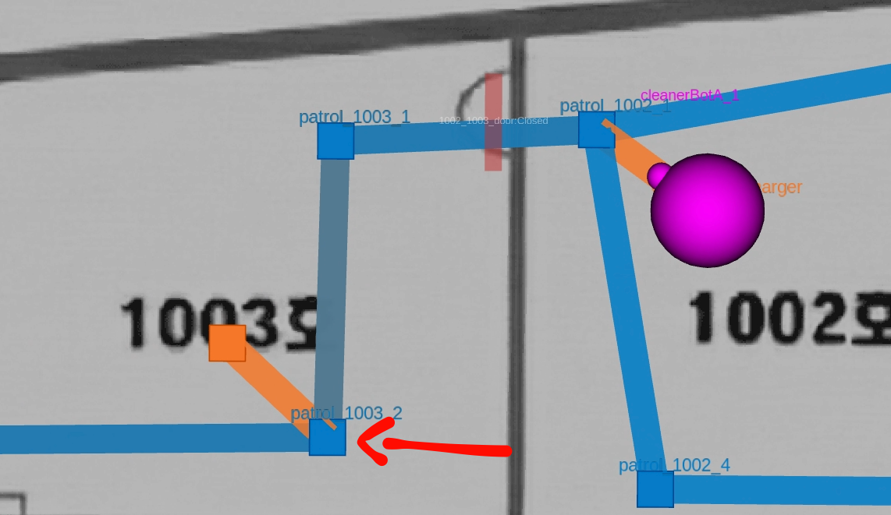

Task를 전송하면 로봇은 즉시 반응합니다.
먼저 목표 지점을 향해 이동을 시작하고, 문 앞에 도착하면 잠시 멈춥니다.
이때 RMF가 door adapter에 개방 요청을 보내며, 문이 열리는 것을 기다립니다.
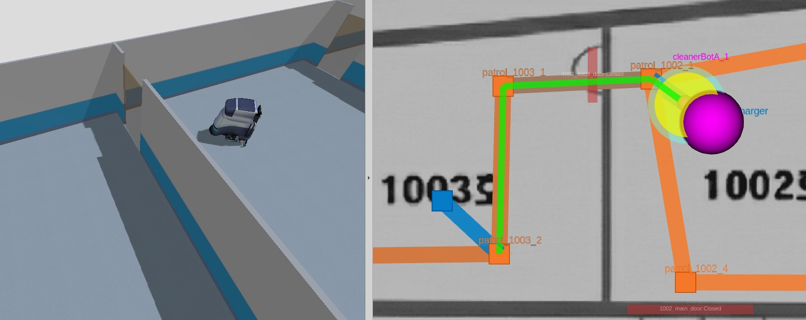

문이 완전히 열리면 로봇은 통과를 시작합니다.
통과 중에도 문이 닫히지 않도록 RMF가 상태를 유지하며, 로봇이 완전히 통과한 후에야 문이 닫힙니다.
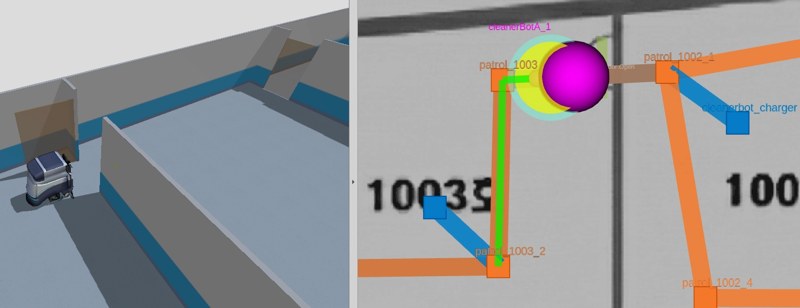

목표 지점에 도착한 로봇은 다시 출발점으로 복귀하는 동작을 반복합니다.
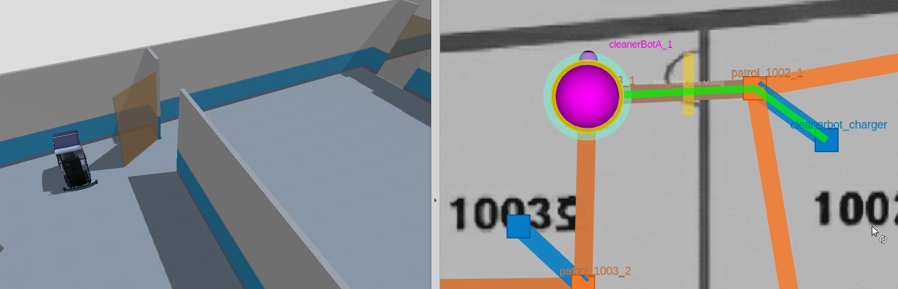

로봇이 문 앞에서 대기하는 순간, 문이 열리는 순간, 통과하는 순간을 관찰합니다.


### Delivery Task (엘리베이터 통과)

Loop Task가 완료되어 로봇이 정지한 후, 이번에는 Delivery Task를 전송합니다.
Delivery Task는 층간 이동을 포함하는 더 복잡한 작업으로, 엘리베이터라는 특수 자원을 사용합니다.

먼저 Gazebo의 2층을 보면 책상 위 콜라가 있는 것을 볼 수 있습니다. 
이 콜라를 1층 테이블에 두고자 하는게 목표입니다. 
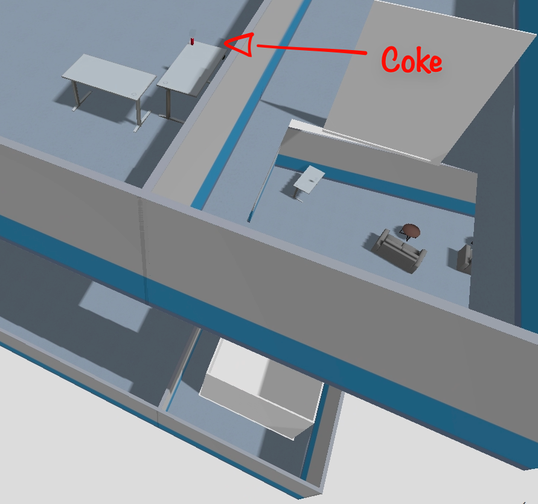

```bash
ros2 run rmf_demos_tasks dispatch_delivery -p patrol_1103_1 -ph coke_dispenser -d patrol_1004_1 -dh coke_ingestor --use_sim_time
```

* 위 명령어는 1103_1에서 coke_dispenser 모델 위에 있는 물체를 PickUp해서, patrol_1004_1에 DropOff하라는 명령어 입니다. 
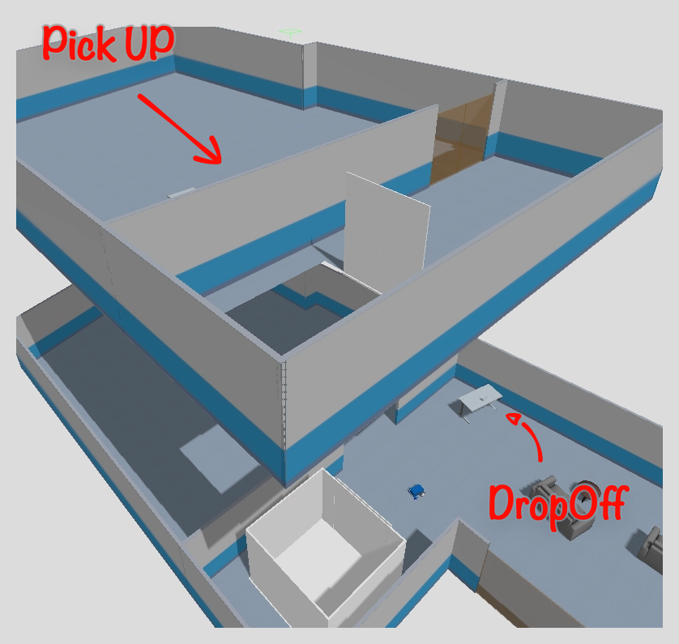


청소로봇은 배달이 불가하여, 배달로봇이 움직입니다. 
로봇은 엘리베이터 앞으로 이동하며, 도착하면 RMF가 elevator adapter에 호출 요청을 보냅니다.
엘리베이터가 현재 다른 층에 있다면, 해당 층으로 이동해 오는 과정도 시뮬레이션됩니다.
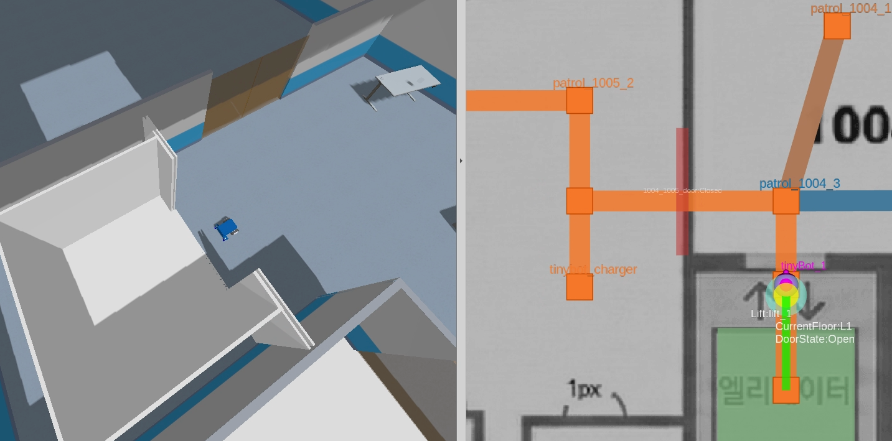

엘리베이터가 도착하고 문이 열리면 로봇이 탑승합니다.
내부에서 목표 층 버튼이 눌리고, 엘리베이터가 이동하는 동안 로봇은 내부에서 대기합니다.
목표 층에 도착하면 문이 열리고, 로봇이 하차하여 최종 목적지로 이동합니다.
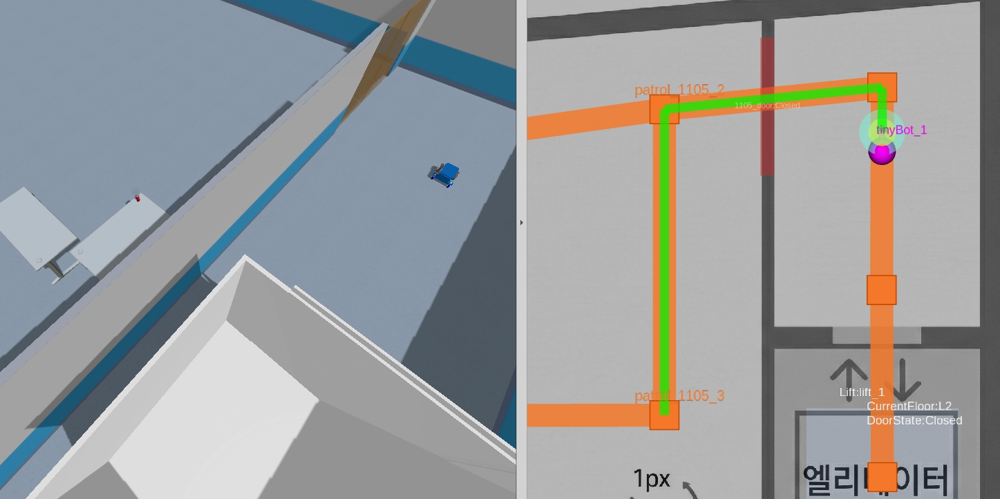

> 이 과정중 rviz에서 다른 층을 보고 싶으면 아래 이미지의 해당 층(```L2```)를 입력하면 됩니다. 
>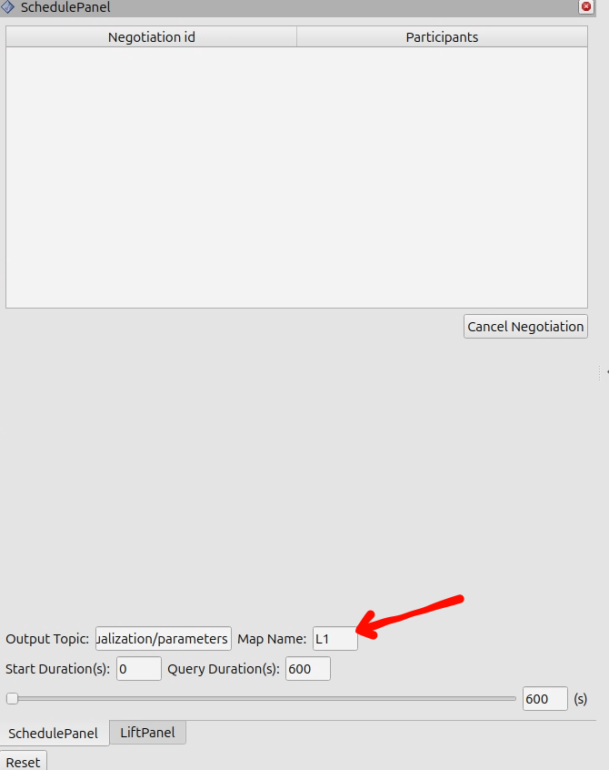

배달로봇이 콜라를 PickUp후에, 다시 엘리베이터를 타고 돌아와서, 목적지에 콜라를 DropOff하게 됩니다. 
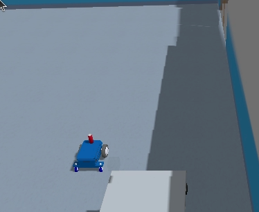
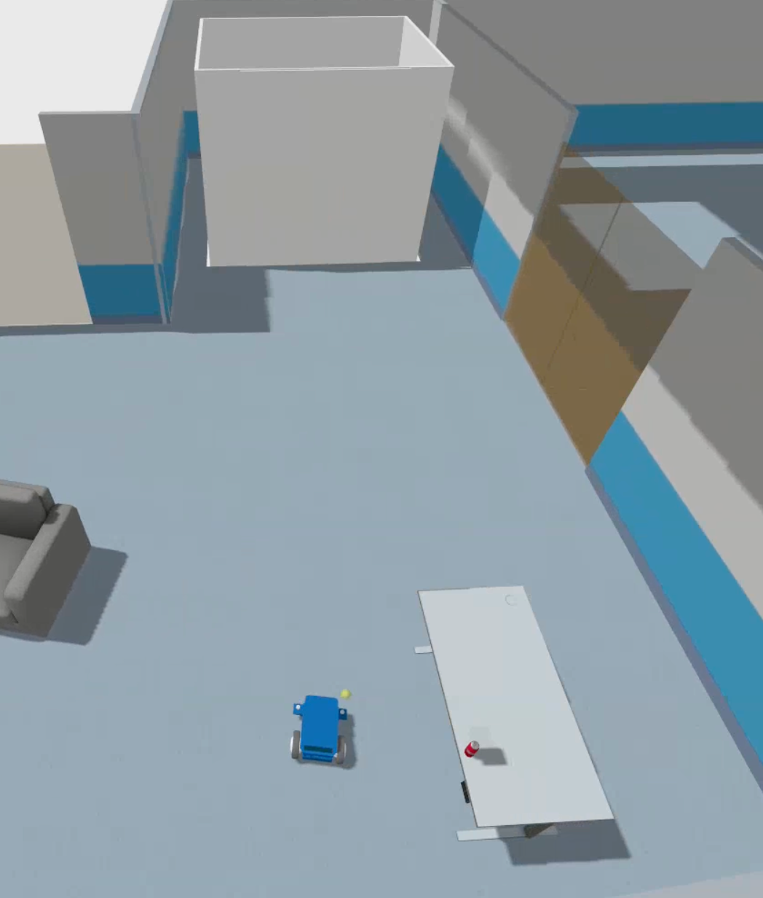

이 전체 과정에서 OpenRMF는 엘리베이터의 상태(어느 층에 있는지, 문이 열렸는지, 누가 탑승 중인지)를 계속 추적합니다.
여러 로봇이 동시에 엘리베이터를 요청할 경우, OpenRMF가 스케줄링하여 충돌 없이 순서대로 처리합니다.

### Task

> 청소 로봇은 배달을 못가기 때문에, 배달로봇이 배달 명령을 수행하였습니다. 이처럼 OpenRMF는 Fleet(로봇의 타입)에 따라서 Task를 적절한 로봇에게 할당합니다.
> 또한 작업을 최적화 하기 위해서, OpenRMF는 로봇의 현재 위치, 작업 상태 등을 고려하여 최적의 경로를 계획합니다.
방금 관찰한 현상의 배후에는 [rmf_task](https://github.com/open-rmf/rmf_task)라는 핵심 컴포넌트가 있습니다. rmf_task는 OpenRMF의 Task 스케줄러로서, "누가, 언제, 어떤 경로로" Task를 수행할지를 지능적으로 결정합니다.

1. Capability 기반 필터링 각 Fleet은 자신이 수행할 수 있는 **능력(Capability)**을 정의합니다. 청소 로봇 Fleet은 순찰(Patrol)과 청소(Clean) 작업만 수행 가능하고, 배달 로봇 Fleet은 배달(Delivery)과 순찰 작업을 모두 수행할 수 있습니다. Delivery Task가 들어오면 rmf_task는 먼저 이 작업을 수행할 수 있는 Fleet만을 후보로 선별합니다. 그래서 청소 로봇은 아무리 가까이 있어도 배달 작업에서 자동으로 제외됩니다.

2. Cost 기반 최적 로봇 선택 적합한 Fleet이 결정되면, 그 Fleet 내에서 어떤 로봇이 작업을 수행할지 선택해야 합니다. rmf_task는 **비용 함수(Cost Function)**를 사용하여 각 후보 로봇을 평가합니다. Cost는 배터리잔량, 로봇의 현위치부터 목적지까지의 거리 및 시간, 로봇의 작업 상태 등을 고려하여 계산됩니다.

3. 자원 예약 및 경로 계획: 선택된 로봇을 위해 최적 경로를 계획하면서, 경로상의 모든 공용 자원(문, 엘리베이터)을 미리 예약합니다. 방금 실행했던 Delivery Task의 경우, 단순한 이동이 아니라 Move → Request Lift → Move → PickUp → Request Lift → Move → DropOff와 같은 복합 시퀀스로 분해되어 각 단계별 자원 사용 계획이 수립됩니다.


---

## 4. Public Resource

문과 엘리베이터는 **모든 로봇이 공유하는 자원**입니다.
각 자원은 **상태**(열림/닫힘, 층 위치 등)를 가지며, 로봇은 자원의 상태에 맞춰 이동합니다.

### 문 (Door)

문은 가장 기본적인 공용 자원이지만, 관리가 필수적입니다.
로봇이 문 앞에서 잠시 멈추는 모습을 보았다면, 그것은 문의 상태가 변경되는 과정을 기다리는 것입니다.

문은 크게 네 가지 상태를 가집니다:
**닫힘 상태**에서는 로봇이 대기하며, RMF가 door adapter에 개방 신호를 전송합니다.
**열림 요청 중**에는 물리적으로 문이 움직이고 있으며, 로봇은 완전히 열릴 때까지 기다립니다.
**열림 상태**가 되면 로봇이 통과를 시작하고, 통과가 완료되면 다시 **닫힘**으로 돌아갑니다.

여러 로봇이 같은 문을 사용해야 할 경우, RMF는 순서를 조율하여 한 로봇이 완전히 통과할 때까지 다른 로봇을 대기시킵니다.
이를 통해 문이 열렸다 닫혔다를 반복하는 비효율을 줄이고, 안전한 통과를 보장합니다.

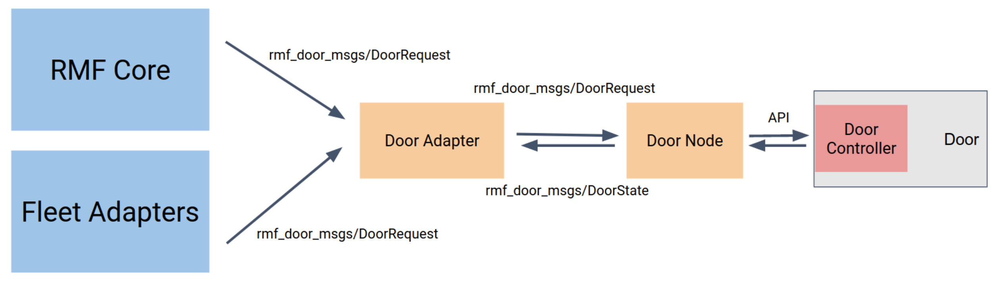

### 엘리베이터 (Lift)

엘리베이터는 문보다 훨씬 복잡한 상태와 절차를 가집니다.
단순히 열림/닫힘뿐만 아니라, 현재 어느 층에 있는지, 어느 층으로 가고 있는지, 누가 탑승 중인지 등을 추적해야 합니다.

엘리베이터의 전체 프로세스는 다음과 같습니다:
로봇이 특정 층의 엘리베이터 앞에 도착하면, RMF가 현재 엘리베이터가 어디에 있는지 확인합니다.
다른 층에 있다면 해당 층으로 이동 요청을 보내고, 로봇은 도착할 때까지 대기합니다.
엘리베이터가 도착하고 문이 열리면 로봇이 탑승하며, 목표 층 버튼이 자동으로 눌립니다.

이동 중에는 다른 로봇이 같은 엘리베이터를 요청할 수 있지만, RMF는 현재 탑승 중인 로봇의 작업이 완료될 때까지 다른 요청을 대기시킵니다.
목표 층에 도착하면 로봇이 하차하고, 엘리베이터는 다시 다른 요청을 처리할 수 있는 상태가 됩니다.

이러한 복잡한 조율이 모두 자동으로 이루어지며, 사람이 개입할 필요가 없습니다.


### 시뮬레이션이 아닌 실제 환경에서는? 
* 시뮬레이션에서 문과 엘리베이터에 대한 제어를 했다고 해도, 실제 환경에서는 문과 엘리베이터와의 통합은 제조사 차이, 통신 방식 차이 등으로 인해 어려움이 있습니다.
* 따라서 실제 환경에서는 제조사에서 제공하는 API를 사용하여 문과 엘리베이터를 제어해야 합니다. 그리고 RMF는 해당 API를 호출하여 문과 엘리베이터를 제어합니다.
* API를 사용하여, OpenRMF에 통합하고자 한다면, 아래 door_adapter와 elevator_adapter를 참고하세요.
* door adapter 참고: [door adapter](https://github.com/open-rmf/rmf_door_adapter)
* elevator adapter 참고: [elevator adapter](https://github.com/open-rmf/rmf_elevator_adapter)
* awesome: 
    * kone E/V adapter: [kone E/V adapter](https://github.com/chart-sg/lift_kone_opccontroller)
    * dormakaba autodoor adapter: [dormakaba autodoor adapter](https://github.com/open-rmf/door_adapter_dormakaba)

---

## 5. What You Should Understand After This Phase
*   **Traffic Editor의 규칙이 Gazebo에 반영**되는 과정을 확인했습니다. 2D 도면이 3D 시뮬레이션으로 변환됩니다.
*   **Task가 로봇을 움직이는 기본 단위**임을 이해했습니다. CLI로 Task를 보내면 로봇이 즉시 반응합니다.
*   **문과 엘리베이터는 상태를 가진 공용 자원**임을 관찰했습니다. RMF가 이들의 상태를 추적하고 조율합니다.
*   **CLI를 통한 Task 전송 방법**을 익혔습니다. 다음 단계에서는 웹 UI를 사용합니다.


## 6. rmf_tasks (optional)
* 방금 전, 우리는 아래 명령어로 Loop Task를 전송했습니다.
```bash
ros2 run rmf_demos_tasks dispatch_patrol -p patrol_1003_2 -n 1 --use_sim_time
```
* 명령어의 의미는 아래와 같습니다.
    * `ros2 run rmf_demos_tasks dispatch_patrol`: rmf_demos_tasks 패키지의 dispatch_patrol 노드를 실행합니다.
    * `-p patrol_1003_2`: patrol_1003_2라는 이름의 Node를 순찰합니다.
    * `-n 1`: 1회 실행합니다.
    * `--use_sim_time`: 시뮬레이션 시간을 사용합니다.
* -p 이후 순찰할 노드의 이름을 적으면 해당 노드를 순찰합니다.
* Rviz2에서 순찰할 노드의 이름을 적어 로봇을 이동해보세요. 배달로봇과 청소로봇이 갈 수 있는 노드는 한정되어있습니다.

---

## 6. Next Step

이제 여러 Task가 동시에 들어왔을 때 **스케줄링이 어떻게 이루어지는지**를 확인할 차례입니다.

*   다음 문서로 이동: [04 Task Scheduling & RMF-Web](04_task_scheduling_rmf_web.md)
