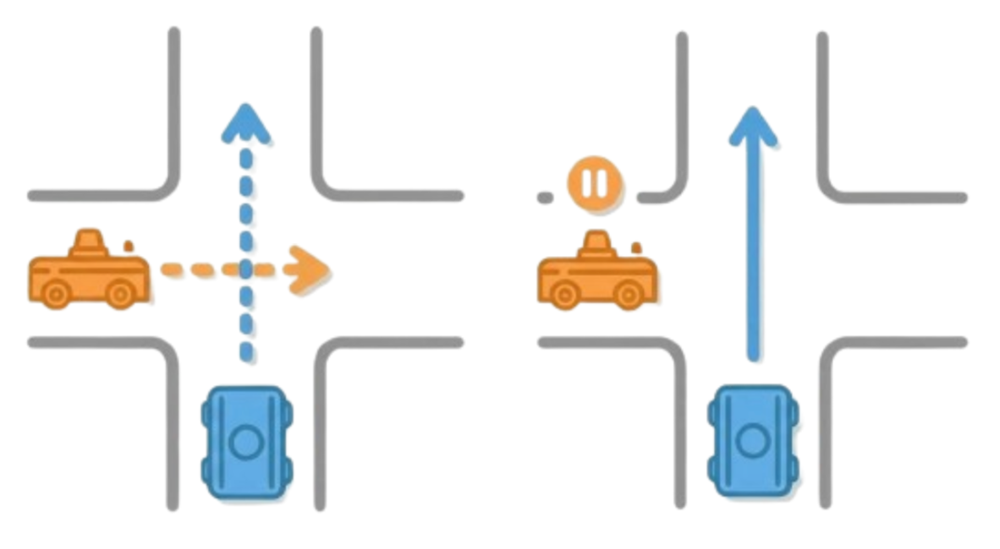
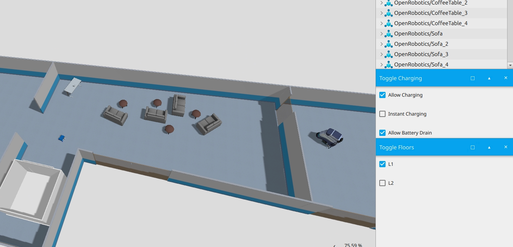
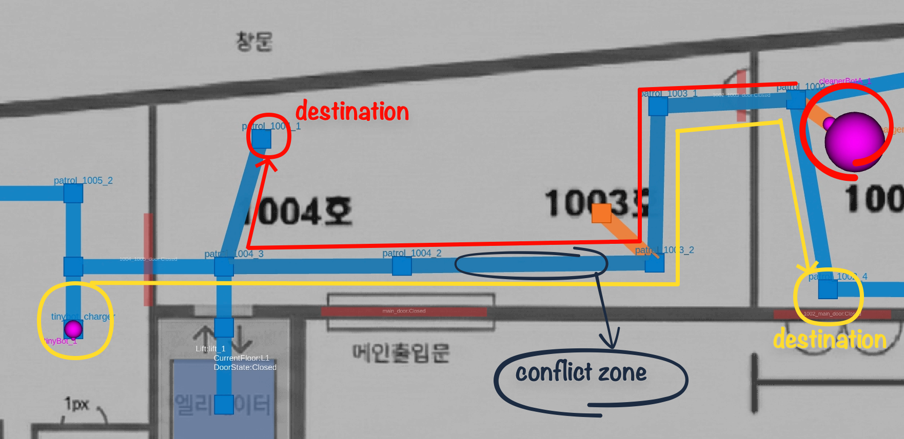
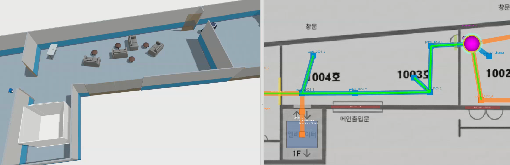
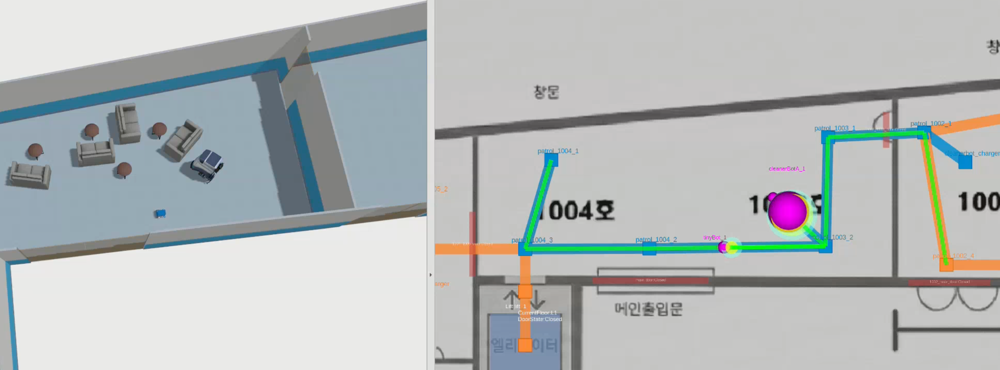
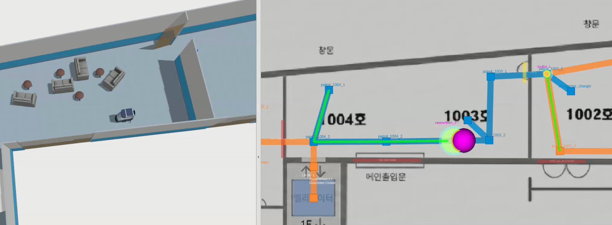
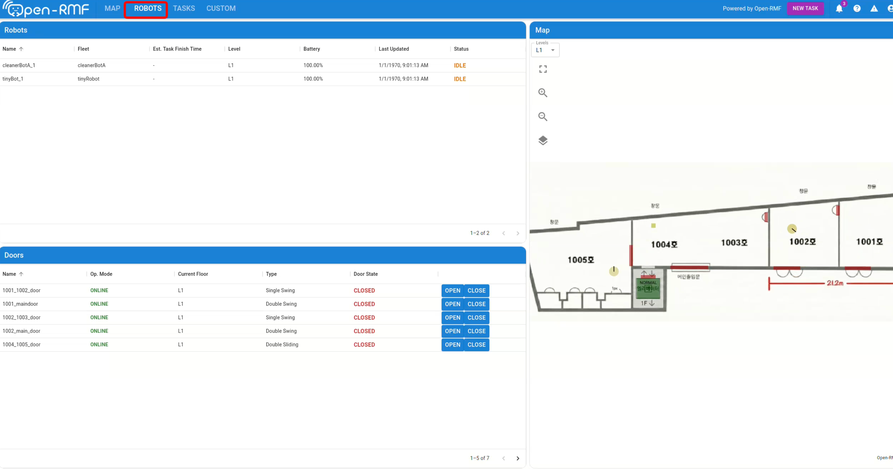
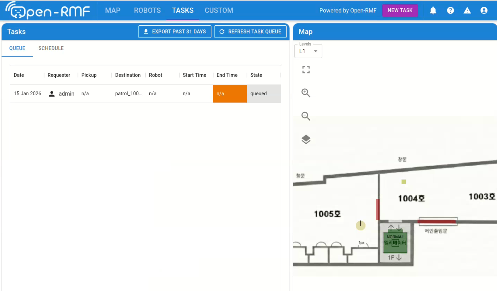
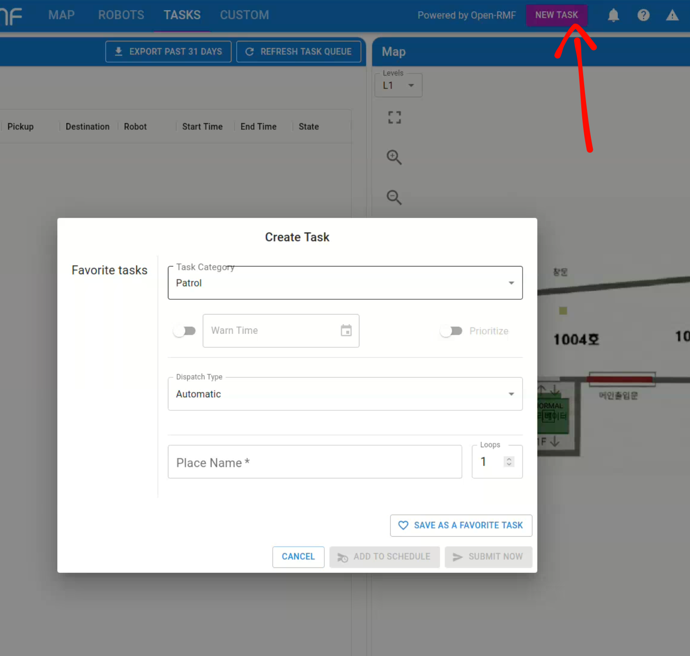
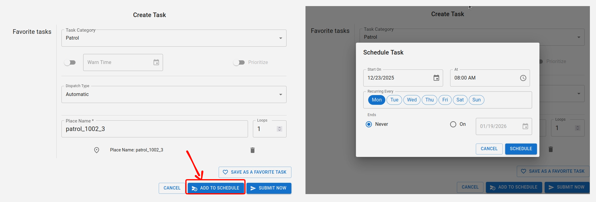

# 04. Task Scheduling & RMF-Web

Task가 동시에 여러 개 들어오면 복잡한 상황이 발생합니다.
이번 단계에서는 **교착 상황(Deadlock)**을 직접 경험하면서 스케줄링의 중요성을 체감하고, 이를 관찰하고 제어하기 위한 도구인 **RMF-Web**을 학습합니다.



## 목차
1. [Introduce](#1-introduce)
2. [World (Gazebo)](#2-world-gazebo)
3. [Deadlock Experience](#3-deadlock-experience)
4. [RMF-Web](#4-rmf-web)
5. [Task via RMF-Web](#5-task-via-rmf-web)
6. [What You Should Understand After This Phase](#6-what-you-should-understand-after-this-phase)
7. [Next Step](#7-next-step)

---

## 1. Introduce

여러 개의 Task가 동시에 들어오는 상황을 상상해 봅니다.
로봇 A는 1층에서 2층으로 물건을 배송해야 하고, 로봇 B는 같은 엘리베이터를 사용해 2층에서 1층으로 내려와야 합니다.
동시에 로봇 C는 1층에서 순찰 임무를 수행 중이며, 로봇 D는 충전이 필요합니다.

이런 복잡한 상황에서 사람이 일일이 "A가 먼저 가고, B는 기다려"라고 지시하는 것은 비현실적입니다.
로봇이 많아질수록, Task가 복잡해질수록 수동 관리의 한계는 명확해집니다.

특히 **교착(Deadlock)** 상황은 다중 로봇 시스템에서 가장 피하고 싶은 시나리오입니다.
좁은 복도에서 두 로봇이 정면으로 마주쳤는데, 둘 다 후진할 공간이 없다면 시스템 전체가 멈춰버릴 수 있습니다.

**이번 단계의 학습 흐름:**
1. **문제 경험**: 먼저 교착 상황을 의도적으로 만들어 문제의 심각성을 체감합니다
2. **도구 필요성 인식**: 이런 복잡한 상황을 관찰하고 제어하기 위한 도구의 필요성을 느낍니다  
3. **도구 활용**: RMF-Web을 통해 효율적인 관제 방법을 학습합니다

RMF의 스케줄링 기능은 이런 상황을 자동으로 처리하지만, 완벽하지는 않습니다. 
때로는 교착이 발생할 수 있고, 이때 관제자가 상황을 파악하고 개입할 수 있는 도구가 바로 RMF-Web입니다.

---

## 2. World (Gazebo)

먼저 시뮬레이션 환경을 실행합니다.

```bash
ros2 launch rosconkr_gazebo workshop.launch.py
```



Phase 2에서와 동일한 환경이 로드되지만, 이번에는 여러 로봇이 동시에 움직이는 복잡한 시나리오를 다룰 것입니다.

---

## 3. Deadlock Experience

지금부터 의도적으로 교착 상황을 만들어 보겠습니다.

### 교착 시나리오 설정

교착을 유발하기 위해, 두 로봇이 좁은 통로에서 서로 반대 방향으로 이동하도록 Task를 설정합니다.
로봇을 직접 지정해서, 배달로봇은 patrol_1002_3으로 보내고, 청소로봇은 patrol_1004_1로 보내보겠습니다. 두 로봇은 협로때문에 경로가 부딪힐 것입니다.



새 터미널을 열고 다음 명령어들을 **한번에** 실행합니다.
```bash
ros2 run rmf_demos_tasks dispatch_patrol -p patrol_1003_2 -n 1 -F TinyRobot -R tinyBot_1 --use_sim_time
ros2 run rmf_demos_tasks dispatch_patrol -p patrol_1004_1 -n 1 -F CleanerBotA -R cleanerBotA_1 --use_sim_time
```



### 교착 관찰 및 RMF의 대응

두 Task를 전송하면, 로봇들이 동시에 움직이기 시작합니다.
처음에는 각자의 목표를 향해 순조롭게 이동하다가, 청소 로봇이 경로중 회피구역으로 들어갑니다. 


**RMF의 Traffic Negotiation**: RMF는 이런 상황을 감지하면 **교통 협상(Traffic Negotiation)** 기능을 작동시킵니다:
- 두 로봇의 예정 경로를 분석하여 충돌 지점을 파악합니다
- 각 로봇의 우선순위, 목적지까지의 거리, 전체 시스템 효율성을 고려합니다
- 한 로봇에게 양보하도록 지시하거나, 우회 경로를 계산합니다

**해결 과정**: 
- 청소 로봇이 근처의 대기 공간으로 잠시 이동합니다
- 배달 로봇이 먼저 통과합니다  
- 배달로봇이 충돌 지점을 벗어난 후에, 청소로봇이 다시 원래 경로로 복귀하여 목표를 향해 이동합니다



**rmf_traffic**:
- OpenRMF의 핵심적인 컴포넌트로, 방금 상황과 같이 로봇 주행 중 충돌을 감지하고, 교착을 해결하는 역할을 합니다.
- 로봇의 위치, 경로, 상태 등을 받아, 교착을 감지하고 해결합니다.
- [rmf_traffic github](https://github.com/open-rmf/rmf_traffic)

### 관찰의 한계

Gazebo, Rviz2 화면만으로는 다음과 같은 정보를 파악하기 어렵습니다:

- 각 로봇이 현재 어떤 Task를 수행 중인지
- 왜 한 로봇이 멈춰 있는지 (대기 중인지, 에러인지)
- Task의 우선순위는 어떻게 되는지
- 전체 시스템에 얼마나 많은 Task가 대기 중인지
- 다른 로봇들은 어떤 영향을 받고 있는지

바로 이 지점에서 **정갈한 인터페이스 시스템**이 필요합니다.

---

## 4. RMF-Web

방금 경험한 교착 상황과 그 해결 과정을 더 명확하게 이해하고 관리하기 위해서는 **시각화 및 제어 도구**가 필요합니다.
**RMF-Web**은 바로 이러한 목적으로 설계된 웹 기반 통합 관제 대시보드입니다.

### RMF-Web의 필요성

CLI 명령어만으로는 다음과 같은 한계가 있습니다:

- Task 상태를 실시간으로 추적하기 어렵습니다
- 여러 로봇의 상태를 동시에 파악할 수 없습니다  
- 교착이나 병목 현상을 조기에 발견하기 어렵습니다
- Task 생성 시 복잡한 파라미터를 입력하기 번거롭습니다
- 스케줄링 결과와 최적화 과정을 시각적으로 확인할 수 없습니다

RMF-Web은 OpenRMF를 사용하는 솔루션에 쉽게 접목가능한  **통합 관제 인터페이스**입니다.

### RMF-Web 실행
#### RMF-Web을 실행하려면 총 3개의 터미널이 필요합니다. 
* OpenRMF 실행 및 Gazebo 실행 
```
ros2 launch rosconkr_gazebo workshop.launch.py server_uri:="ws://localhost:8000/_internal"
```
* rmf-web api-server 실행
```
cd ~/rmf-web/packages/api-server
pnpm start 
```
* rmf-web dashboard 실행
```
cd ~/rmf-web/packages/rmf-dashboard-framework
pnpm start:example example/demos
```

`http://localhost:5173`으로 접속하면 메인 대시보드에 접근할 수 있습니다.


### 대시보드 구성

#### **Robots 탭**

Fleet 영역은 각 로봇의 실시간 상태를 표시합니다.
로봇의 이름, 현재 위치, 배터리 잔량, 수행 중인 Task, 다음 목표 등의 정보가 표 형태로 정리되어 있습니다.
또한 로봇이 아닌, door나 E/V 같은 인프라 장비도 표시됩니다.



#### **Tasks 탭**

화면 왼쪽 또는 상단에 위치한 Task 영역은 현재 시스템의 모든 Task를 보여줍니다.
대기 중인 Task, 실행 중인 Task, 완료된 Task가 각각 다른 색상으로 표시되어 한눈에 구분할 수 있습니다.

**스케줄링 최적화도 여기서 확인할 수 있습니다**: Task가 제출된 순서와 실제 실행 순서가 다를 수 있는데, 이는 RMF가 전체 시스템의 효율을 높이기 위해 순서를 재조정한 결과입니다.




---

## 5. Task via RMF-Web

교착 상황을 경험하고 RMF-Web의 필요성을 이해했으니, 이제 RMF-Web을 통해 **더 효율적으로 Task를 관리**하는 방법을 익힙니다.


### Task 생성

CLI 명령어 대신 RMF-Web UI에서 Task를 생성하면 훨씬 더 직관적이고 편리합니다.

RMF-Web 화면에서 **New Task** 버튼을 클릭하면 Task 생성 폼이 나타납니다.



**Task 유형 선택**: Patrol, Delivery, Loop, Clean 등 다양한 옵션이 드롭다운으로 제공됩니다. 각 유형마다 필요한 파라미터가 자동으로 표시됩니다.

**지점 선택**: 시작 지점과 목표 지점은 Vertex 이름을 직접 입력하거나, **지도에서 클릭**하여 선택할 수 있습니다. CLI에서는 Vertex 이름을 정확히 기억해야 했지만, RMF-Web에서는 지도를 보면서 직관적으로 선택할 수 있습니다.

**우선순위 설정**: 긴급한 Task는 높은 우선순위를 설정하여, RMF가 다른 Task보다 먼저 처리하도록 할 수 있습니다.

**Fleet 지정**: 특정 Fleet에게만 Task를 할당하거나, 자동으로 최적의 Fleet을 선택하도록 할 수 있습니다.

### Task 전송 및 스케줄링 관찰

Task를 전송하면 즉시 Task 큐에 추가되며, RMF가 스케줄링을 시작합니다.

**실시간 상태 변화**: Task 목록에서 방금 생성한 Task의 상태가 변하는 것을 실시간으로 볼 수 있습니다.

**지능적 로봇 할당**: Fleet 영역에서 어떤 로봇이 선택되었는지 확인할 수 있습니다. RMF가 다음 요소들을 종합적으로 고려하여 최적의 로봇을 선택한 결과입니다:
- 현재 위치에서 출발지까지의 거리
- 배터리 잔량 및 충전 필요성
- 이미 할당된 다른 Task들의 완료 예상 시간
- 전체 시스템의 부하 분산

**경로 시각화**: 지도에서 로봇의 예정 경로가 선으로 표시되어, 어떤 경로로 이동할지 미리 파악할 수 있습니다.

### Task 시간대에 맞춰 생성

단순하게 Task를 보낼 뿐만 아니라, 반복되는 시간대의 작업은 RMF-Web에서 쉽게 생성할 수 있습니다.
예를 들어 매주 월요일 아침 8시에 배달 업무를 해야한다면, RMF-Web에서 아래 사진과 같이 설정하여 매주 월요일 아침 8시에 배달 Task를 생성하도록 설정할 수 있습니다. 


---

## 6. What You Should Understand After This Phase
*   **RMF의 Traffic Negotiation 능력**을 관찰했습니다. 교착을 감지하고 자동으로 해결하는 과정을 확인했습니다.
*   **RMF-Web의 주요 기능**을 익혔습니다. Task 생성/전송, Fleet 모니터링, 지도 시각화, 실시간 상태 추적 등을 실습했습니다.

## 7. Additional Resources
* 현재는 의도적으로 길을 좁게 배치하여, 교착상황을 관찰하고자 하였습니다.
* 다만, 실제 환경에서 사용하려고 할 때, 특정 상황이 아니라면 교착상황을 일으키지 않는 Traffic Map을 설계하는 것이 좋습니다.
* Traffic Map에서 교통 설계에 대한 그래프 전략을 [링크](https://osrf.github.io/ros2multirobotbook/integration_nav-maps-strategies.html)에서 참조할 수 있습니다. 

---

## 8. Next Step

시뮬레이션에서의 교착 해결과 스케줄링을 확인했습니다.
이제 이러한 시스템이 **실물 로봇 환경에서 어떻게 구현되는지** 확인할 차례입니다.

*   다음 문서로 이동: [05 Fleet Adapter 문서](05_fleet_adapter.md)