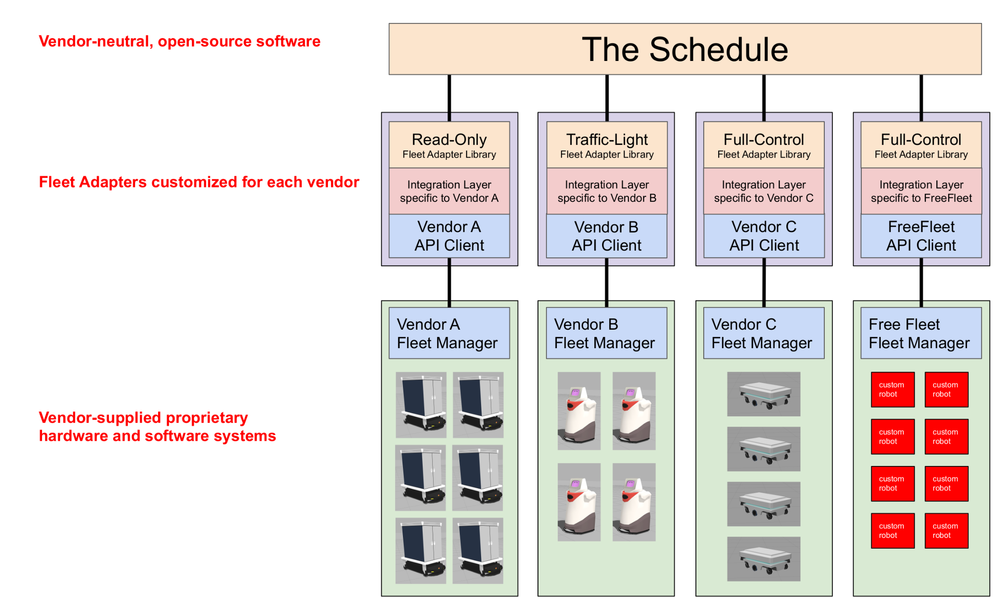
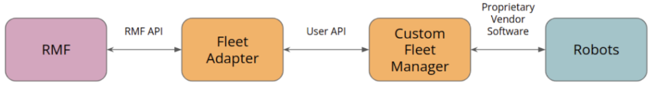
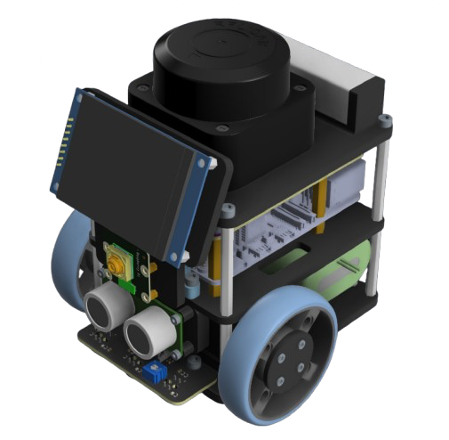
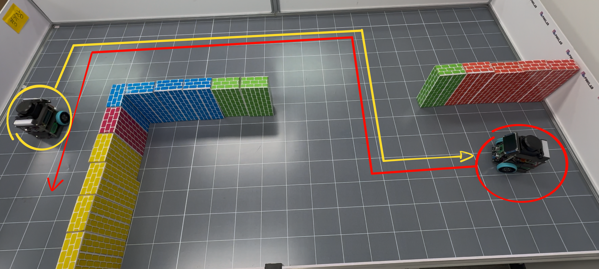

# 05. Fleet Adapter

Fleet Adapter는 시뮬레이션과 실물 로봇을 연결하는 계층입니다.
이번 단계에서는 Pinky 실물 로봇을 사용하여 RMF의 조율 기능이 실제 환경에서 어떻게 작동하는지 관찰합니다.
이 단계는 OpenRMF의 핵심요소중 fleet adapter를 직접 구축해보고자 합니다.

## 목차
1. [Introduce](#1-introduce)
2. [Fleet Adapter](#2-fleet-adapter)
3. [Pinky](#3-pinky)
4. [Fleet Adapter Template](#4-fleet-adapter-template)
5. [Deadlock](#5-deadlock)
6. [What You Should Understand After This Phase](#6-what-you-should-understand-after-this-phase)
7. [Next Step](#7-next-step)

---

## 1. Introduce

지금까지 Gazebo 시뮬레이션에서 OpenRMF의 작동 방식을 확인했습니다.
Traffic Editor로 규칙을 정의하고, 시뮬레이션에서 로봇이 움직이고, Task를 스케줄링하는 전 과정을 경험했습니다.

하지만 실제 환경은 시뮬레이션과 다릅니다.
사용하는 로봇이, Navigation2를 사용할 수도 있고 혹은 MQTT통신을 통하여 로봇을 제어할 수도 있습니다.
로봇의 제조사 별로 이동/제어할 수 있게 하는 방식 자체가 다르기 때문에, OpenRMF에서는 Fleet Adapter가 필요합니다.

Fleet Adapter가 있기 때문에, OpenRMF는 시뮬레이션에서만 작동하는 것이 아니라 실제 로봇에도 적용할 수 있습니다.
제조사나 모델이 다른 로봇들도, 각자의 Fleet Adapter만 있으면 RMF 시스템에 통합할 수 있습니다.

이번 단계는 소형 로봇인 Pinky 로봇을 사용하여 병목 구간에서의 조율과 교착 상황 해소를 실제로 확인합니다.



---

## 2. Fleet Adapter

Fleet Adapter는 RMF의 계획을 로봇이 이해할 수 있는 명령으로 변환합니다.
즉, **RMF와 로봇을 이어주는 통역사** 역할을 수행합니다.

### Fleet Adapter의 핵심 역할

Fleet Adapter는 양방향 통신을 담당합니다.

**RMF → 로봇 방향:**
RMF가 전송하는 추상적인 Task("A 지점에서 B 지점으로 이동")를 로봇의 구체적인 API 호출로 변환합니다.
예를 들어, RMF가 "charging_station_1로 이동"이라고 하면, Fleet Adapter는 이를 로봇의 네비게이션 시스템이 이해할 수 있는 좌표와 명령으로 바꿉니다.

**로봇 → RMF 방향:**
로봇의 현재 상태(위치, 속도, 배터리, 센서 데이터 등)를 주기적으로 RMF에 보고합니다.
RMF는 이 정보를 바탕으로 스케줄링과 경로 계획을 수행하므로, 정확하고 빠른 상태 보고가 중요합니다.

**협상 참여:**
다른 로봇과 경로가 충돌할 때, Fleet Adapter는 RMF의 협상 프로세스에 참여합니다.
"이 시간에 이 경로를 사용해도 되는가?"라는 질문에 답하고, 필요하면 경로를 조정합니다.




## 3. Pinky
Fleet Adapter를 구축하기 전, 간단하게 Pinky에 대한 소개가 필요할 것 같습니다. 
Pinky는 워크숍에서 사용하는 실물 로봇 플랫폼입니다.



### Pinky 로봇의 특징

Pinky는 교육 및 연구용으로 설계된 이동형 소형 로봇입니다.

**자율 주행 기능:**
SLAM을 통하여 구축된 Pointcloud Map을 사용하여 주행합니다. [Navigation2](https://github.com/ros-navigation/navigation2)을 통하여 주행하여, 스스로 위치를 파악하고 장애물을 회피합니다.

**RMF 통합:**
Navigation2 주행하기때문에, 로봇은 이동할 목적지는 Nav2 액션 서버를 통해 받습니다.
또한 amcl 알고리즘을 사용하여 스스로의 위치를 추정하기 때문에, ros2 topic으로 amcl_pose를 관찰하여 위치를 볼 수 있습니다.
OpenRMF로 부터 이동할 지점은 Nav2 액션 서버를 통해 전달하고, amcl_pose를 통해 자기 위치를 OpenRMF에 전달하는 방식으로 fleet adapter를 구축할 수 있습니다. 

**Fleet 구성:**
워크숍에서는 **2대 이상**의 Pinky를 사용하여 실제 Fleet 운영 상황을 재현합니다.
여러 로봇이 같은 공간에서 동시에 작동하면서, 서로의 경로를 조율하는 모습을 볼 수 있습니다.

###  경기장
경기장은 중앙에 좁은 복도가 있습니다.
이 복도는 의도적으로 좁게 설계되어, 두 로봇이 동시에 지나갈 수 없습니다.
따라서 한 로봇이 통과할 때 다른 로봇은 반드시 대기해야 하며, 이 과정에서 RMF의 조율 능력을 확인할 수 있습니다.


---

## 4. Fleet Adapter Template

`pinky_adapter`는 `fleet_adapter_template`를 기반으로 제작되었습니다.
Template을 이해하면, 자신의 로봇을 RMF에 연동하는 방법을 배울 수 있습니다.

### Template 구조

`fleet_adapter_template`는 RMF와의 통합을 표준화하여, 다양한 로봇 플랫폼에 쉽게 적용할 수 있도록 설계되었습니다.

```bash
fleet_adapter_template
├── config.yaml # Fleet Adapter의 설정 파일
├── fleet_adapter_template
│   ├── fleet_adapter.py # Fleet Adapter의 주요 로직이 구현된 파일
│   ├── __init__.py
│   └── RobotClientAPI.py # 로봇 API 인터페이스 정의
├── package.xml
```

* Fleet Adapter Template구조는 매우 심플합니다. 

**역할 분리가 핵심입니다:**
- `fleet_adapter.py`: 복잡한 RMF 통신, 스케줄링, 협상 로직 처리 (그대로 사용)
- `RobotClientAPI.py`: **여러분의 로봇 API에 맞게 구현하는 유일한 파일**

#### **RobotClientAPI.py: "빈칸 채우기" 개념**

이 파일은 **8개의 빈 함수**가 있는 템플릿입니다. 각 함수에 `# IMPLEMENT YOUR CODE HERE` 주석이 있고, 이 빈칸들만 채우면 어떤 로봇이든 RMF에 통합할 수 있습니다.

**데이터 흐름:**
```
RMF ↔ Fleet Adapter ↔ RobotClientAPI ↔ (REST/ROS2/MQTT) ↔ 로봇
```

#### 필수로 구현되어야 할 함수
```python
def position(self, robot_name: str):
    ''' 현재 위치 [x, y, theta] 반환 '''
    return [x, y, theta]

def navigate(self, robot_name: str, pose, map_name: str, speed_limit=0.0):
    ''' 목적지로 이동 명령 전송 (명령만 보내고 즉시 리턴) '''
    return True  # 명령 전송 성공 여부

def is_command_completed(self):
    ''' 마지막 명령 완료 여부 '''
    return True
```
위 함수에 각 로봇별로 구현해야합니다. 예를 들어 Navigation2를 사용하는 로봇의 경우, navigate 함수에는 아래와 같이 구현할 수 있습니다.
```python
def navigate(self, robot_name: str, pose, map_name: str, speed_limit=0.0):
    goal_msg = NavigateToPose.Goal()
    goal_msg.pose.pose.position.x = pose[0]
    goal_msg.pose.pose.position.y = pose[1]
    self.nav2_client.send_goal_async(goal_msg)
    return True
```

이 함수들만 각 로봇 API에 맞게 채우면, REST든 ROS2든 MQTT든 상관없이 OpenRMF에 통합됩니다.

### **Pinky Fleet Adapter 구현**

Pinky Fleet Adapter는 `fleet_adapter_template`의 **RobotClientAPI.py 핵심 4개 함수**만 Pinky 방식에 맞게 구현해서 완성했습니다.

**구현 매핑:**
- `navigate()` → **Nav2 액션** (`NavigateToPose`) 비동기 전송
- `position()` → **AMCL 토픽** (`amcl_pose`) 실시간 구독
- `battery_soc()` → **배터리 토픽** (`battery/present`) 0~100% → 0.0~1.0 변환  
- `is_command_completed()` → **Nav2 완료 콜백** 상태 확인

**핵심 코드:**
```python
def navigate(self, robot_name: str, pose, map_name: str, speed_limit=0.0):
    goal = NavigateToPose.Goal()
    goal.pose.pose.position.x = pose[0]
    self.nav2_client.send_goal_async(goal)  # 비동기
    return True

def position(self, robot_name: str):
    return self._last_poses.get(robot_name)  # AMCL 콜백 업데이트
```

**다중 로봇:** `config.yaml`에서 `/pinky_1`, `/pinky_2` 네임스페이스로 구분하여 하나의 Fleet Adapter가 여러 Pinky 동시 관리

**핵심:** 이 4개 함수만 **여러분 로봇의 통신 방식(REST/MQTT/기타)에 맞게 채우면** 동일하게 OpenRMF 통합 완료됩니다.

---

## 5. Deadlock

경기장 중앙 복도에서 병목 상황을 연출합니다.
두 로봇이 양쪽에서 동시에 진입하려 하면, 교착 가능성이 있습니다.



### RMF 없이 vs RMF와 함께

먼저 RMF 없이 단순 네비게이션만 사용하는 경우를 상상해 봅니다.
두 로봇이 각자의 경로 계획에 따라 동시에 복도에 진입하려 합니다.
서로를 장애물로 인식하여 멈춰 서고, 양쪽 모두 "상대방이 비켜주기를 기다리는" 무한 대기 상태에 빠집니다.

RMF를 사용하면 상황이 달라집니다.
RMF는 두 로봇의 경로를 미리 파악하고, 충돌을 예측합니다.
한 로봇에게 "대기 지점에서 잠시 기다려"라고 지시하고, 다른 로봇이 먼저 통과하도록 조율합니다.

### 실제 관찰

RMF-Web에서 두 Task를 거의 동시에 전송하여, 두 로봇이 복도를 향해 이동하게 합니다.
```
ros2 run rmf_demos_tasks dispatch_patrol -p node_A -n 1 -F pinky -R pinky_1 --use_sim_time
ros2 run rmf_demos_tasks dispatch_patrol -p node_C -n 1 -F pinky -R pinky_2 --use_sim_time
```
경기장을 지켜보면, 한 로봇은 복도에 진입하기 전 회피구역으로 이동합니다. 
첫번째 로봇이 충돌지역을 완전히 통과한 후, 대기하던 로봇이 이동을 재개합니다.
이 전체 과정이 사람의 개입 없이 자동으로 이루어지며, 충돌이나 교착 없이 매끄럽게 진행됩니다.


### [OpenRMF Pinky Demo 영상](https://drive.google.com/file/d/1frxRHX6pMNco8gXkT-u6yyjE9vLr6NKT/view?usp=share_link)


---

## 6. another Fleet Adapter(optional)
* Fleet Adapter Template을 기반으로 Pinky Fleet Adapter를 구현했습니다. 하지만, 실제로 사용해보면 많은 부분이 개선이 필요합니다.
* Fleet Adapter Template로 로봇을 OpenRMF에 통합하기는 매우 쉽게 구현할 수 있지만,  디테일을 잡기는 어렵습니다. 이에 대해서, 다른 Fleet Adapter를 참고하여 더 나은 Fleet Adapter를 구현할 수 있습니다.
* awesome adapter: https://github.com/open-rmf/awesome_adapters 
     * 각 로봇 제조사에서 배포한 Fleet adapter 혹은 잘 만들어진 Fleet adapter를 오픈소스로 제공합니다. 
* Free Fleet : https://github.com/open-rmf/free_fleet
     * navigation2을 사용하는 로봇에 대해 zenoh를 사용하여 통신하는 Fleet adapter입니다. 다수의 navigation 로봇을 다뤄야한다면 유용합니다. 
* inoic demo : https://github.com/gazebosim/ionic_demo
     * navigation2, Moveit2! 를 사용하여 OpenRMF에 통합한 demo 사례입니다. 실제 배달을 Gazebo plugin이 아닌, 매니퓰레이터가 도와주는 형태입니다.


## 6. What You Should Understand After This Phase

이 단계를 마치고 다음을 이해해야 합니다:

*   **Fleet Adapter는 RMF와 실물 로봇의 다리**입니다. 추상적인 Task를 구체적인 명령으로 변환합니다.
*   **fleet_adapter_template의 역할**을 이해했습니다. 다양한 로봇을 RMF에 쉽게 통합할 수 있습니다.

---

## 7. Next Step

워크숍의 핵심 흐름이 실물 로봇으로 완료되었습니다.
이제 마무리와 참고 자료를 정리하는 단계로 넘어갑니다.

*   다음 문서로 이동: [06 마무리 문서](./06_ending.md)
