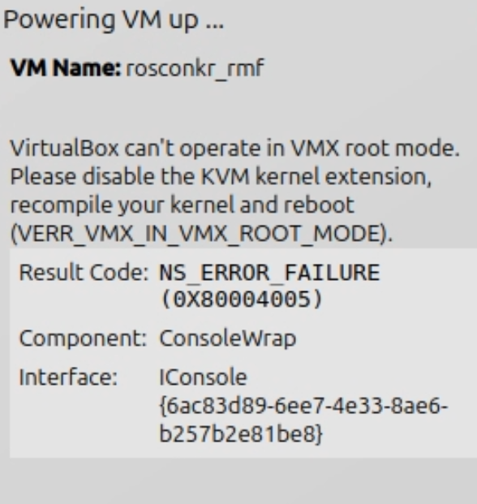

## Ubuntu VirtualBox 설치
* 이 문서에서는 Ubuntu기반 PC에 VirtualBox를 설치하는 방법을 안내합니다.


### 1. VirtualBox 설치

* [VirtualBox 다운로드]
```bash
sudo apt install virtualbox
```
* 실행
```bash
virtualbox
```


### 2. VM 이미지 다운로드 및 로드
* [VM 이미지 다운로드](https://drive.google.com/file/d/1AQ1p-v_Ih1RFSXm0r2R0Ns-v_cy0bHd3/view?usp=sharing)

* virtualbox에서 File -> Import Appliance 선택
* 
* 다운로드한 파일 선택 후 RAM, CPU 등 설정 확인 후 Import (RAM 8GB, CPU 4core 이상 권장)
* 

* 

### 3. VM 실행
* Username rosconkr_rmf
* Password 1

---
### 3.1 kvm 에러 해결
* 

* Intel CPU면:
```bash
sudo modprobe -r kvm_intel
sudo modprobe -r  kvm

```
* AMD CPU면:
```bash
sudo modprobe -r kvm_amd
sudo modprobe -r kvm
```
이후 VirtualBox를 다시 켜 보세요.