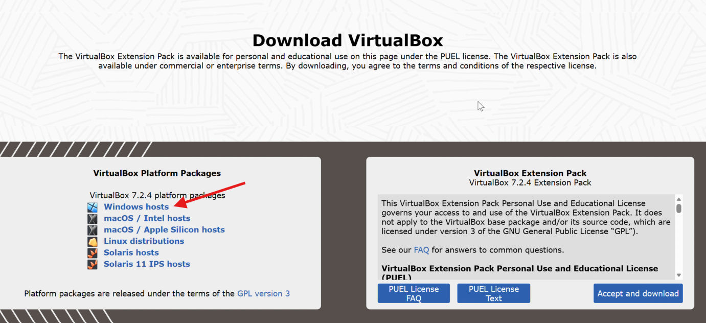
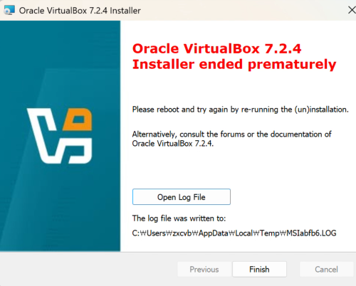
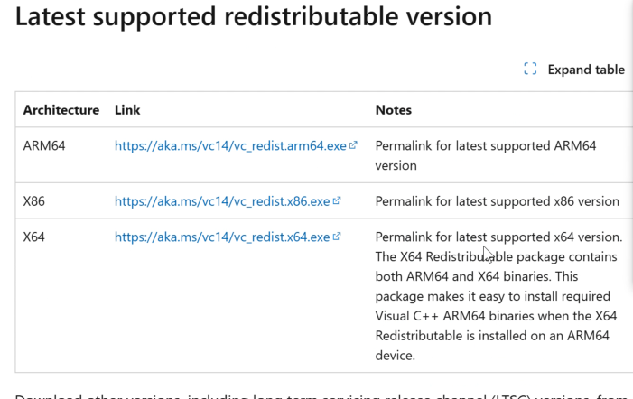
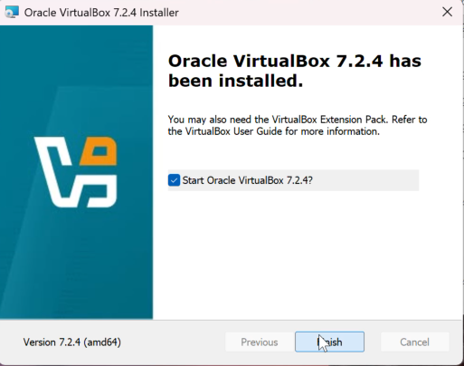
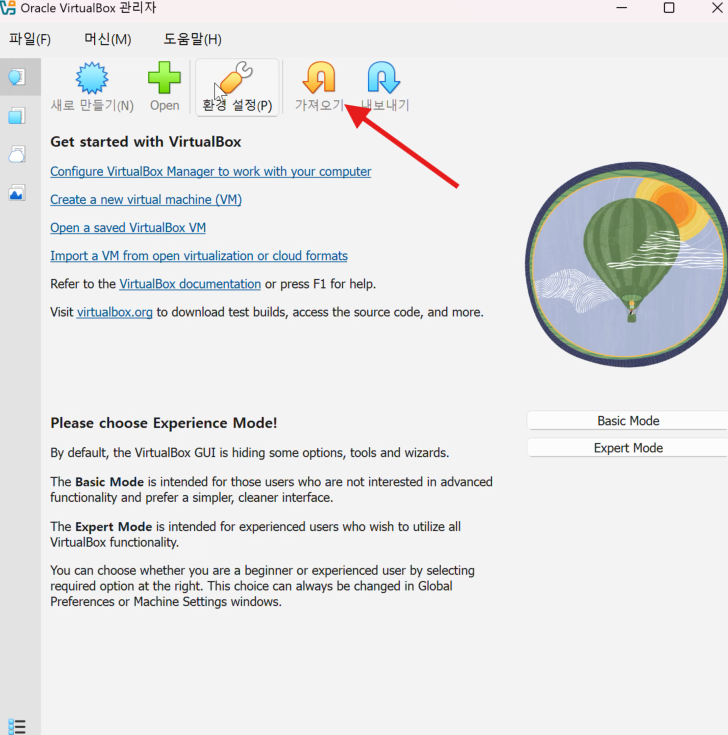
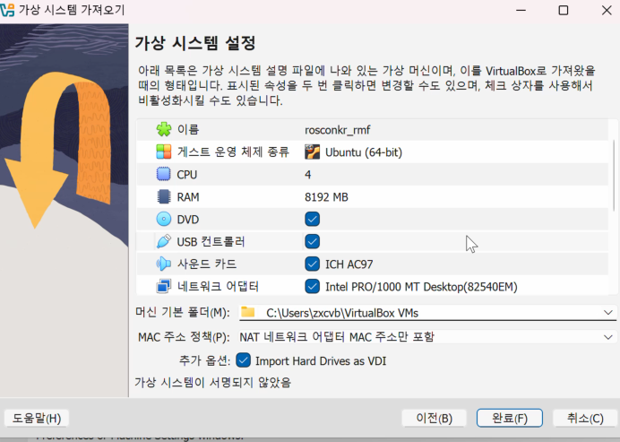
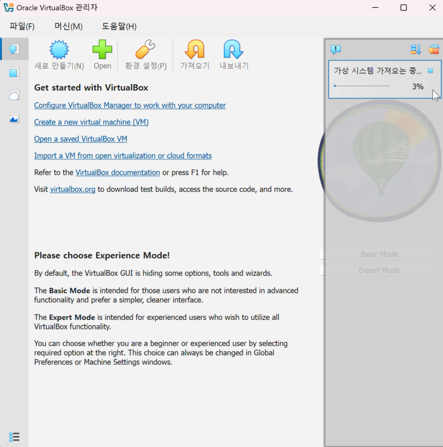

## Windows VirtualBox 설치
* 이 문서에서는 Windows기반 PC에 VirtualBox를 설치하는 방법을 안내합니다.

### 1. VirtualBox 설치

* [VirtualBox 다운로드](https://www.virtualbox.org/wiki/Downloads)
* 

> 만약 설치중 아래 에러를 마주쳤다면 ... 
* 
* [Visual Studio용 Microsoft Visual C++ 재배포 가능 패키지 다운로드](https://learn.microsoft.com/ko-kr/cpp/windows/latest-supported-vc-redist?view=msvc-170)
* 
* 각 PC 아키텍처 맞게 설치 후 재부팅

* virtualbox 재설치하면 설치 완료.

### 2. VM 이미지 다운로드 및 로드
* [VM 이미지 다운로드](https://drive.google.com/file/d/1AQ1p-v_Ih1RFSXm0r2R0Ns-v_cy0bHd3/view?usp=sharing)

* virtualbox에서 File -> Import Appliance 선택
* 
* 다운로드한 파일 선택 후 RAM, CPU 등 설정 확인 후 Import
* 

* 

### 3. VM 실행
* Username rosconkr_rmf
* Password 1